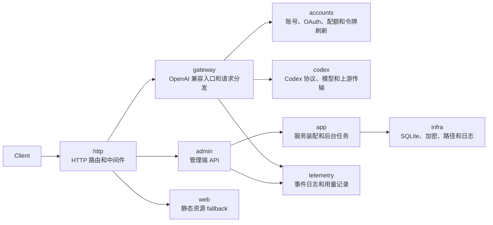

# codex-proxy-rs

面向 ChatGPT/Codex 账号池的 Rust 代理服务，提供 OpenAI 兼容接口，并尽量贴近 Codex Desktop 的上游请求行为。

## 特性

- OpenAI 兼容的 `/v1/chat/completions`、`/v1/responses` 和 `/v1/models`
- ChatGPT/Codex OAuth、device code、refresh token 账号接入
- 账号池轮转、限流恢复、会话亲和性和 WebSocket 上游
- Codex Desktop 风格的 headers、TLS、Cookie、fingerprint 和 reasoning replay
- SQLite 存储、密钥加密、结构化日志和管理端 API

## 快速开始

```bash
cargo run
```

默认读取根目录 `config.yaml`。本项目不依赖 `local.yaml`，本地敏感值、数据库路径、日志路径和管理员默认密码都应直接在 `config.yaml` 中配置。

运行时数据默认写入 `.runtime`，历史或手动生成的根目录 `logs/` 也作为本地运行产物忽略：

```text
.runtime/data/
.runtime/logs/
logs/
```

默认监听 `0.0.0.0:8080`。首次启动会初始化管理员账号，默认值来自 `config.yaml`，长期使用请修改配置中的管理员密码。

## 开发

```bash
cargo fmt --check
cargo clippy --all-targets -- -D warnings
cargo test --all-targets
```

## 架构



## License

MIT
