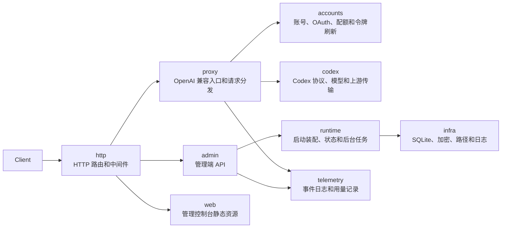

<p align="center">
  
</p>

<h1 align="center">Codex Proxy RS</h1>

<p align="center">
  轻量、安全、高效的 Codex 模型网关。
</p>

<p align="center">
  <code>/v1/responses</code> · <code>/v1/chat/completions</code> · <code>/v1/models</code> · 管理控制台
</p>

Codex Proxy RS 是一个面向 ChatGPT/Codex 账号池的 Rust 模型网关。它把上游 Codex 能力整理成 OpenAI 兼容接口，同时提供账号调度、配额感知、请求追踪、事件日志和管理控制台。

它不是一个臃肿的平台，也不是只做转发的薄代理。它更像一层安静但可靠的网关：把账号、模型、配额、Cookie、WebSocket、SSE 和错误恢复放在后端统一处理，让调用方只需要面对稳定、清晰的 OpenAI 风格接口。

## 为什么需要它

当你有多个 Codex 账号、多个调用方和持续运行的任务时，真正麻烦的通常不是发出一条请求，而是让每条请求都走在正确的账号、正确的模型和正确的上游状态上。

Codex Proxy RS 关注这些细节：

- 账号是否可用，是否过期、禁用、封禁或配额受限
- 请求应该落到哪个账号，是否要保持会话亲和性
- 上游返回的是 HTTP SSE、WebSocket 还是错误事件
- Cookie、fingerprint、headers 和 Codex Desktop 行为是否足够接近
- 管理端能否看清请求、用量、事件、延迟和失败原因

## 核心能力

**OpenAI 兼容入口**

- `POST /v1/responses`
- `POST /v1/chat/completions`
- `GET /v1/models`
- `GET /v1/models/catalog`

**Codex 账号池**

- 支持 ChatGPT/Codex OAuth、device code、refresh token 账号接入
- 支持账号轮转、并发控制、请求间隔和会话亲和性
- 支持账号状态、配额、Cookie、模型目录和连接测试管理

**上游行为对齐**

- Codex Desktop 风格的 headers、TLS、fingerprint 和 Cookie 处理
- HTTP SSE 与 WebSocket 上游传输
- reasoning replay、tuple schema、compact/review 等 Codex 请求路径

**可观测与管理**

- 管理控制台内置账号、密钥、事件日志、用量统计和系统设置
- SQLite 持久化，敏感密钥加密存储
- 结构化事件日志，便于定位请求失败、上游状态和调度路径

## 快速开始

```bash
cargo run
```

默认读取根目录 `config.yaml`，监听 `0.0.0.0:8080`。首次启动会初始化管理员账号，默认用户名和密码来自 `config.yaml`：

```yaml
admin:
  default_username: admin
  default_password: admin
```

长期运行前请修改默认密码，并确认数据库、密钥和日志路径符合你的部署环境。

运行时数据默认写入 `.runtime`：

```text
.runtime/data/
.runtime/logs/
```

## 管理控制台

前端位于 `web/`，用于账号管理、密钥管理、事件日志、仪表盘和系统设置。

开发模式：

```bash
pnpm --dir web dev
```

生产构建：

```bash
pnpm --dir web build
cargo run
```

后端会将构建后的前端资源作为静态页面提供，并保留 API 路由优先级。

## 配置重点

`config.yaml` 只放启动级配置，模型由客户端请求决定，网关不会兜底默认模型；`auth`、`quota`、模型别名和模型账号路由都不再从 YAML 读取：

```yaml
server:
  host: 0.0.0.0
  port: 8080

api:
  base_url: https://chatgpt.com/backend-api

database:
  url: sqlite://.runtime/data/codex-proxy-rs.sqlite

logging:
  directory: .runtime/logs
```

## 开发验证

后端：

```bash
cargo fmt --check
cargo clippy --all-targets --all-features --locked -- -D warnings
RUSTFLAGS="-D warnings" cargo test --all-targets --all-features --locked
```

前端：

```bash
pnpm --dir web build
```

## 架构



## License

MIT
