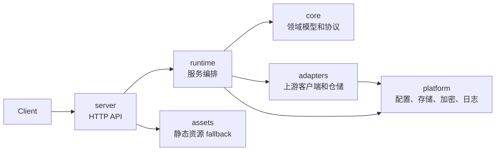

# codex-proxy-rs

面向 ChatGPT/Codex 账号池的 Rust 代理服务，提供 OpenAI 兼容接口，并尽量贴近 Codex Desktop 的上游请求行为。

## 特性

- OpenAI 兼容的 `/v1/chat/completions`、`/v1/responses` 和 `/v1/models`
- ChatGPT/Codex OAuth、device code、refresh token 账号接入
- 账号池轮转、限流恢复、会话亲和性和 WebSocket 上游
- Codex Desktop 风格的 headers、TLS、Cookie、fingerprint 和 reasoning replay
- SQLite 存储、密钥加密、结构化日志和管理端 API

## 快速开始

```bash
cargo run -p codex-proxy-server
```

默认读取根目录 `config.yaml`，并按需合并本地覆盖文件：

```text
local.yaml
local.yml
```

运行时数据默认写入 `.runtime`：

```text
.runtime/data/
.runtime/logs/
```

默认监听 `0.0.0.0:8080`。首次启动会初始化管理员账号，默认值来自 `config.yaml`，长期使用请在 `local.yaml` 中覆盖。

## 开发

```bash
cargo fmt --check
cargo clippy --workspace --all-targets --all-features --locked -- -D warnings
cargo test --workspace --all-targets
```

## 架构



## License

MIT
