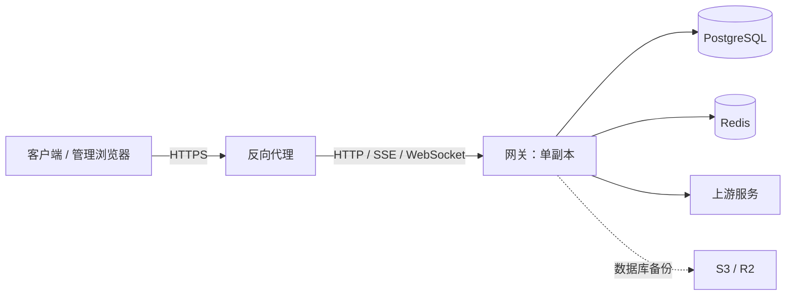

# 部署与运维

首次安装可按 [快速开始](../README.md#快速开始) 操作。
本文补充客户端配置、权限、备份和升级；部署命令从安装目录 `codex-proxy-rs/` 执行，
其中 `deploy/` 存放 Compose 文件和配置，`.runtime/` 存放持久化数据。

配置按职责保存，不都在 YAML 中：

| 位置 | 内容 | 修改方式 |
| --- | --- | --- |
| `deploy/config.yaml` | 监听、数据库/Redis 连接、部署凭据与日志等启动配置 | 从模板创建，已有部署合并修改，不覆盖原文件 |
| `deploy/compose.yaml` | 镜像、容器网络、端口、挂载与资源限制 | 调整 Compose 并重建受影响容器 |
| PostgreSQL | 账号、Key、运行设置、上游身份、插件配置等业务数据 | 管理端或管理 API |
| 浏览器本地 | 主题和界面偏好 | 当前浏览器的主题设置 |

项目不使用 `.env` 配置文件。Compose 环境变量用于容器地址、镜像选择和构建发布。
配置加载会忽略未知或已移除的字段，并在启动控制台提示字段名；不输出对应值。缺少必填字段时会指出缺项并停止启动，
已知字段的类型和取值仍需合法；可选字段省略时使用默认值。

## 部署结构



网关端口默认只绑定本机；数据库和 Redis 不对公网开放。插件以网关同一系统身份运行，不能作为不可信代码沙箱。

## 手动安装

本节适用于 Linux amd64/arm64，需准备 Docker Engine、Docker Compose Plugin、curl 和 OpenSSL，
并确保当前用户能访问 Docker、可通过 `sudo` 或 root 设置目录权限。一键安装入口见
[快速开始](../README.md#一键安装)，脚本会自动完成本节准备和服务启动。

下载同一正式 Release 的部署文件并设置目录权限：

```bash
mkdir -p codex-proxy-rs/deploy && cd codex-proxy-rs

# 只解析一次最新正式版本，确保两个文件来自同一 Release。
CPR_RELEASE_URL="$(curl -fsSL -o /dev/null -w '%{url_effective}' https://github.com/zyycn/codex-proxy-rs/releases/latest)"
CPR_RELEASE_TAG="${CPR_RELEASE_URL##*/}"
curl -fsSL "https://github.com/zyycn/codex-proxy-rs/releases/download/${CPR_RELEASE_TAG}/compose.yaml" \
  -o deploy/compose.yaml
curl -fsSL "https://github.com/zyycn/codex-proxy-rs/releases/download/${CPR_RELEASE_TAG}/config.example.yaml" \
  -o deploy/config.example.yaml

install -d -m 0750 .runtime/postgres .runtime/redis
sudo install -d -m 0770 -o "$(id -u)" -g 10001 .runtime/data .runtime/logs
sudo install -m 0640 -o "$(id -u)" -g 10001 deploy/config.example.yaml deploy/config.yaml
```

也可将 `CPR_RELEASE_TAG` 设置为指定的发布标签。Release 附带的 `compose.yaml` 默认使用该版本镜像，
配置模板和部署文件均包含在 `checksums.txt` 中；不要混用 `main` 分支模板与已发布镜像。

为 PostgreSQL 与 Redis 分别生成一个密码：

```bash
openssl rand -hex 24
openssl rand -hex 24
```

把两个 48 位十六进制结果分别写入 `deploy/config.yaml` 的：

- `store.database.password`
- `store.redis.password`

另行设置 `admin.default_password`。它至少需要 12 个字符，不能是常见弱口令，也不能包含 `$`。
`client.session_ttl_minutes` 控制统一登录中密钥身份的固定会话有效期，默认 1440 分钟；管理员有效期仍由
`admin.session_ttl_minutes` 控制。两种身份共用一个 Cookie，成功登录替换旧会话；不改变 `/v1/*` 鉴权和限额。

PostgreSQL 与 Redis 密码必须是 48 位十六进制字符。Compose 通过 `config.yaml` 的凭据桥接区
引用同一密码；三个值都不需要额外导出为环境变量，数据库和 Redis 密码也不能嵌入连接 URL。

Linux 上应用容器以 `10001:10001` 运行。上述命令将应用数据和日志目录设为 `0770`，
配置设为 `0640`，均由当前用户持有、容器组 `10001` 访问。
`config.yaml` 通过 Compose `configs` 只读挂载，普通 Compose 保留宿主机文件的 UID/GID 和 mode。

## 启动

```bash
docker compose -f deploy/compose.yaml config --quiet
docker compose -f deploy/compose.yaml pull
docker compose -f deploy/compose.yaml up -d --no-build --wait
docker compose -f deploy/compose.yaml ps
```

健康检查：

```bash
curl -i http://127.0.0.1:8080/healthz
```

`204 No Content` 表示应用、PostgreSQL、Redis 和后台任务的健康检查通过，不代表每个上游账号都可用。

不要把未脱敏的 `docker compose config` 或 `docker inspect` 输出上传到工单；它们会包含
PostgreSQL/Redis 启动密码。日常校验使用 `config --quiet`。

### 启动后的运行设置

在管理端修改以下设置，保存后对新请求生效，重启不会覆盖已保存的选择：

| 设置 | 入口与边界 |
| --- | --- |
| 上游客户端身份 | “系统设置 → 上游配置 → 客户端身份”；Key 可按 Provider 覆盖，支持自动或固定版本 |
| 全局请求位置 | “系统设置 → 上游配置 → 请求位置覆盖”；默认关闭，不从 YAML 导入 |
| 代理位置 | “代理管理”；优先于全局位置，全局关闭时仍可独立生效 |

位置覆盖只影响 OpenAI 请求中受支持的位置、日期与时区信息，不改变真实出口 IP、epoch 时间戳或系统时区。
`openai.residency` 是独立的部署约束。身份与位置字段见 [运行设置 API](../docs/api.md#8-运行设置)。
后台账号操作使用 Provider 自己的官方画像；发布资料刷新不改写用户选择或 `config.yaml`。

### 插件命令行

使用与网关相同的工作目录和 `deploy/config.yaml`，读取制品已接受且当前已启用的插件实例：

```bash
codex-proxy-rs plugin --help
codex-proxy-rs plugin <实例ID> <命令> --help
codex-proxy-rs plugin <实例ID> <命令> --参数 值
```

不带子命令或使用 `serve` 时启动网关；插件命令不监听 HTTP、不启动后台任务，也不恢复或清理正在运行的
网关准入状态。顶层 `--help/--version` 不读取配置。插件帮助只读数据库，不执行迁移、登录或账号保存，
因此需要先由正常部署完成数据库初始化。宿主诊断保留在配置的文件日志中，stdout/stderr 专用于命令结果。

参数支持 `--名称=值` 或 `--名称 值`；布尔参数可直接写 `--名称`，关闭时写 `--名称=false`。
duration 使用 `500ms`、`1m30s` 等带单位形式。参数可能进入 shell 历史和系统进程列表，不能因为插件声明
了敏感参数就认为命令行是安全的密钥输入通道；真实凭据优先使用对应插件提供的受控登录或导入入口。

成功命令原样返回插件退出码与输出。命令受总期限约束，`Ctrl-C` 或终止信号会取消调用并回收插件进程。
若命令产生账号，只有成功结果才按顺序通过 Admin 保存；调用受制品访问域、`command_line` 阶段和当前资源事实约束，
模型执行 Key 由具体调用选择，不在实例中预绑定。
部分保存后失败或取消不会自动重放，先核对账号和审计记录，再决定是否重新执行。

独立仓库 `codex-proxy-plugins` 的 `examples/request-workbench` 提供不访问真实上游的综合示例。

## 公网访问

Compose 默认只绑定 `127.0.0.1`。从其他设备访问时，在应用前配置反向代理，
不要把 PostgreSQL 或 Redis 暴露到公网。

同源登录页的管理员与 API Key 登录都支持 HTTP 和 HTTPS 登录。反向代理应原样保留浏览器的 `Origin`，
不要清除它或改写 Cookie 的 `Secure` 属性；HTTPS 反代可以使用 HTTP 回源。
HTTP 传输不加密，公网部署仍建议使用 HTTPS。
会话 Cookie 合同见 [管理接口鉴权](../docs/api.md#管理接口)。

反向代理需要保留 `Authorization`，支持 `/v1/responses` 的 WebSocket Upgrade，
并关闭 SSE 响应缓冲。读取超时应覆盖长时间生成任务。
客户端使用部署地址下的 `/v1`，协议与部署一致，不要使用前端开发服务的 `5173/dev/v1`。
当前应用只支持单副本，不能通过复制容器扩容。

流式响应在首个上游事件提交后，每 15 秒无输出会发送一次 SSE 注释保活，
并设置 `X-Accel-Buffering: no` 和 `Cache-Control: no-cache, no-transform`。
反向代理仍需允许这些响应头生效；首个事件到达前的等待也需要足够的读取超时。

OpenAI 上游池化 WebSocket 默认每 25 秒发送一次 Ping，发出后允许等待 30 秒；
收到 Pong 或其他入站帧即解除本次心跳截止，持续无响应则以 `pong_timeout` 关闭连接。
此策略也覆盖正在生成的请求，与等待下一条上游消息的 `stream_idle_timeout_ms` 分别计时。

若 Codex 在压缩或长时间生成时出现 `error decoding response body`，这表示
客户端读取 HTTP 响应体失败。请结合网关请求诊断中的 `upstream.read.failed`、
`downstream.body.closed` 和反向代理日志判断断开位置，不能仅凭此消息认定是 JSON 格式错误。
SSE 注释保活用于防止传输链路空闲断开，不会重置 Codex 等待完整 SSE 事件的超时；
若报错为 `idle timeout waiting for SSE`，再检查客户端的 `stream_idle_timeout_ms`。

## 客户端配置

在管理端创建客户端密钥，打开「使用密钥」，按操作系统复制 `config.toml` 和 `auth.json`，
或通过 CCSwitch 导入。已有文件先备份，合并后完全退出并重启 Codex。
CCSwitch 导入同时配置当前 Key 的日／周额度查询，当前 Provider 默认每 30 分钟刷新。
查询地址和凭据随导入生成，在 CCSwitch 中修改 Provider 的地址或 Key 后，需重新导入以同步用量查询。

Linux/macOS 默认目录为 `~/.codex/`，Windows 为 `%USERPROFILE%\.codex\`；
设置过 `CODEX_HOME` 时以该目录为准。Provider 设置应写入用户配置，不要只写到项目目录。
配置层级见 [官方配置参考](https://learn.chatgpt.com/docs/config-file/config-reference)。

### config.toml

以下示例与当前管理端模板的配置项一致。替换地址和密钥，模型可改成该密钥有权限使用的模型：

```toml
model_provider = "OpenAI"
model = "gpt-5.6-terra"
review_model = "gpt-5.6-terra"
model_reasoning_effort = "max"
service_tier = "default"

[model_providers.OpenAI]
name = "OpenAI"
base_url = "http://127.0.0.1:8080/v1"
wire_api = "responses"
supports_websockets = false
requires_openai_auth = false
# 填写代理密钥，真实账号由服务端管理。
experimental_bearer_token = "<client-api-key>"

[model_providers.OpenAI.http_headers]
# 供客户端识别服务端托管认证，本身不是密钥。
X-OpenAI-Actor-Authorization = "proxy-managed"

[features]
image_generation = true
goals = true
```

`OpenAI` 是自定义 Provider ID，大小写要与 `model_provider` 一致。合并配置时修改已有表，
不要重复添加 `[features]` 或 Provider 表。更换模型时也要检查其支持的推理强度。
密钥以明文保存，文件仅供本人读取，不要提交到 Git。

### auth.json

```json
{
  "OPENAI_API_KEY": "<client-api-key>"
}
```

使用 `auth.json` 读取密钥的客户端或 CCSwitch 可保留这份文件。上述 Provider 配置从
`experimental_bearer_token` 读取代理密钥，可与仅含 API Key 的 `auth.json` 共存。
真实 OpenAI OAuth 账号文件用于管理端账号导入，不要当作代理配置分发给客户端。

### 生图和 WebSocket

模板启用原生生图。Codex 可在任务需要图片时调用 `image_gen.imagegen`，
再通过代理的 Images 接口生成或编辑图片；也可以在需求中明确要求生成并使用图片。
需要支持该能力的客户端、支持图片输入的对话模型，以及有生图权限和额度的 OpenAI 账号。
代理不会增加上游权限，xAI 账号不能承接这些 Images 请求。

生图不要求开启 WebSocket。要启用客户端 WebSocket，把当前 Provider 的
`supports_websockets` 改为 `true`，并检查反向代理是否允许 Upgrade。

客户端到代理、代理到上游是两段独立连接。客户端关闭 WebSocket 后，
服务端仍可能用 WebSocket 访问上游；客户端开关不控制服务端连接池和 HTTP 回退策略。

### 客户端配置兼容

仅含代理密钥的 `auth.json` 配合 `requires_openai_auth = true` 仍可用于已有请求，
但 API Key 登录本身不会启用原生生图。需要生图时换用上述 Provider 配置。

使用 Codex 0.153.4 时，旧配置中的以下字段需删除或替换：

| 字段 | 处理 |
| --- | --- |
| 顶层 `disable_response_storage` | 无有效配置定义，删除 |
| 顶层 `network_access = "enabled"` | 无有效配置定义，删除；不是客户端 API 的联网开关 |
| `features.responses_websockets_v2` | 已标记移除，使用 Provider 的 `supports_websockets` |

`image_generation` 和 `goals` 仍有效。不要为了接入代理，顺带扩大命令沙箱的联网或文件权限。

### 登录与生图排查

- 仍提示登录：确认实际读取的用户配置目录、选中的 Provider 和客户端版本，再完全退出重启。
  新 Provider 使用 `requires_openai_auth = false`，不依赖本地 ChatGPT 登录。
- 没有生图工具：检查配置是否被覆盖、Actor 标记是否保留、模型是否支持图片输入。
  官方客户端还会检查缓存登录状态；已核验版本在本地账号为 Free 时会隐藏生图。
  先备份并区分本地真实账号文件与代理密钥文件，不要直接删除全部登录状态。
- 已调用生图但失败：查看服务端账号的凭据、权限、额度和请求错误，不能只凭文本对话成功判断。
- `401`：检查代理密钥是否正确、是否启用；Actor 标记不能代替密钥。
- `426`：检查客户端版本及反向代理是否保留版本头，低于管理员设置的最低版本时需要更新客户端。
  手机远程控制的版本识别范围见 [版本门禁规则](../docs/api.md#1-鉴权与公共约定)。
- 地址包含 `5173/dev/v1`：这是开发代理地址，依赖 Vite 服务。日常使用改成后端或 HTTPS 地址；
  验证 WebSocket 时直接连接后端，当前 Vite 代理未显式开启 WebSocket 转发。

其他客户端使用 Responses API、`/v1` Base URL 和代理密钥即可，不需要 Actor 标记。
路由与请求格式见 [API 参考](../docs/api.md#3-openai-数据面与模型目录)。

## 优雅关停

收到停止信号后，应用先停止接收新连接并 drain 存量连接；整个 drain 共享一个从停止信号
起算的绝对截止点（`host.drain_timeout_seconds`，默认 30 秒），逾期放弃等待，存量连接随
进程退出终止。drain 结束后才关停后台 worker，预算为
`host.worker_shutdown_timeout_seconds`（默认 30 秒），两段预算按最坏情况串联。

Compose 的 `stop_grace_period` 为 75 秒，覆盖默认 30 秒 HTTP drain、30 秒 worker 收尾和额外调度
余量。若调大任一应用超时，也必须把 `stop_grace_period` 调到大于两段超时之和；否则 Docker 会在
宽限期结束时 SIGKILL。

## 本地开发

本地开发需要克隆源码仓库，以下命令从仓库根目录执行。PostgreSQL 和 Redis 可继续由 Compose 启动：

```bash
docker compose -f deploy/compose.yaml up -d postgres redis
cd backend
cargo run -p codex-proxy-rs
```

后端会从当前目录向上查找 `deploy/config.yaml`。`host.runtime_data_dir` 是运行数据的统一根目录，
相对数据和日志目录均以该配置文件所在目录解析；Compose 把监听地址和数据库、Redis 地址固定
覆盖为容器内部服务名，并把前端静态目录指向容器内构建产物。PG/Redis 集成测试所需的
`CPR_TEST_DATABASE_URL` / `CPR_TEST_REDIS_URL` 约定见
[迁移文档](../backend/migrations/README.md)。

管理端的依赖准备与 UI 源码联调见 [贡献与验证](../CONTRIBUTING.md#验证)。另开终端从仓库根目录启动前端：

```bash
pnpm --dir frontend dev
```

## 持久化与备份

Compose 使用以下绑定目录：

- `.runtime/data` → OpenAI 会话锚点密钥、更新状态、临时更新目录与备份暂存区
- `.runtime/logs` → 应用文件日志
- `.runtime/postgres` → PostgreSQL
- `.runtime/redis` → Redis AOF

普通 `docker compose down` 不会删除这些目录。删除 `.runtime` 会永久清除本地状态。

PostgreSQL 是账号、Client Key、运行设置、请求记录与审计的权威存储；账号 credential 当前按
Provider schema 以明文 JSON 保存于 PostgreSQL。Redis 只保存可重建、可过期的协调状态，例如
会话亲和、lease、cooldown、OAuth pending flow 与套餐模型目录 cache。

OpenAI 主动额度重置卡及其消费结果由上游持有，不写入 PostgreSQL/Redis，也不属于本地备份内容；
管理端只在当前浏览器会话中保留最近一次查询结果。

数据库可用管理端的 S3/R2 逻辑备份，或停库后备份 `.runtime/postgres`。
不要在 PostgreSQL 写入期间直接复制数据目录作为一致性备份。要保留 OAuth 的 AT/RT 恢复记录，需保持
`host.logging.oauth_recovery: true` 并备份 `.runtime/logs`；恢复记录位于独立文件集，仍按普通日志的
`retention_days` 按完整日期保留。若希望保留短期 Redis 状态和会话锚点，也同时备份 `.runtime/redis` 与
`.runtime/data`。

文件日志以时间完整性为清理依据，**没有文件数量淘汰上限**：

| 文件集 | 保留配置 | 默认完整窗口 |
| --- | --- | --- |
| 普通日志、OAuth 恢复日志 | `host.logging.file.retention_days` | 至少 7×24 小时 |
| 全量请求/响应报文 | `host.logging.request_dump_retention_days` | 至少 24 小时（默认 1） |

文件名统一为 `codex-proxy-rs-<类别>.YYYY-MM-DD[.N].log[.gz]`，类别分别为
`application`、`oauth-recovery`、`request-dump`。专用 tracing target 为 `oauth_recovery` 和
`request_dump`；普通日志保留各 Rust 模块的 target，便于按模块过滤。
程序只管理上述规范名称的日志，其他命名的文件由运维手动清理。
普通日志未配置 `retention_days` 时默认使用 7 天，显式配置优先。

按 UTC 日期整组保留：例如 9 月 8 日配置 1 天，会保留 9 月 7 日全天及 9 月 8 日的所有分片，
到 9 月 9 日才允许清理 9 月 7 日。这会略多保留，保证跨午夜及高流量时不留下半天日志。
配置 7 天同理，保留前 7 个完整 UTC 日期及当天；若旧日期分片近期又被写入，整组延后删除。
`max_file_size_mb` 仅决定分片大小（默认 20 MiB），不决定保存时长，单条大记录不会被截断。
关闭的分片压缩为 `.log.gz`；成功压缩、同步并发布归档后才删除原文件，保留原修改时间。
清理发生在启动和轮转时；空闲期间过期文件可能暂时多保留。检索时须同时读取 `.log` 与 `.log.gz`。

报文开关为 `host.logging.request_dump`，默认关闭；开启时原始报文按块完整写入独立文件，
数据库请求诊断仍是有界摘要，不能用摘要事件数代替全量报文完整性。

文件写入使用有界队列背压，正常退出会排空队列并同步文件。`file_logging` 健康探针在写入/同步失败后
报告 `Unhealthy`，本次进程内恢复写入也不会清除已有缺口；压缩或清理失败报告 `Degraded`。
断电、强杀或磁盘故障可能造成日志丢失；需要恢复已删除文件时，应使用独立备份。
容量不足时不会提前删除保留窗口内日志，必须根据完整日期的压缩后实际用量规划空间，并监控磁盘余量和
健康探针。Docker stdout 的独立轮转不承担应用文件日志的完整保留承诺。

完整运行时、Provider、revision 与恢复边界见 [架构文档](../docs/architecture.md)。

## 请求错误排查

1. 先记录故障时间和时区、网关版本/提交、客户端名称与版本，以及 HTTP/SSE/WebSocket 传输。
   区分“上游返回”“网关实际响应”和“客户端终端展示”，不要只凭终端的统一文案推断根因。
2. 收集响应中的 `x-gateway-request-id`、`x-request-id` / `x-oai-request-id`；配置了
   `api.request_id_header` 时也记录该入口头。WebSocket 合成错误的关联头位于本条错误的 `headers`。
   在管理端错误列表按 ID 和时间搜索；检查平台条件并主动刷新，翻页不会推进查询时间。
   只有入口 ID 时，改用入口日志和时间定位。
3. 打开错误详情，核对上游/客户端状态、发送状态、attempt、失败阶段及后续恢复关联。
   下载默认诊断包作为反馈材料，先看 `availability`、`attemptsComplete` 和淘汰计数；
   该包不含原始错误正文或完整 trace data。分享前仍应检查关联 ID 等内部信息。
4. 需要更细上下文时，在 `codex-proxy-rs-application.*.log` 及 `.log.gz` 中按网关/上游 ID
   和时间检索，结合 `attempt.started`、`attempt.failed`、`request.finished` 与 transport 阶段判断。
   **开启 `host.logging.file.enabled` 时，stdout 仅保留 `gateway_startup` 通道**；
   `docker logs` 看不到业务错误不代表没有错误。关闭普通文件日志且开启 `host.logging.stdout`
   时，普通日志才按级别输出到 stdout；专用 dump/OAuth 恢复通道不会混入。
5. 查不到请求记录时，先用模型执行 ID 在“全部平台”下搜索：已进入执行会话的建流前失败也会记录，
   但其 attempt 为零，尚未确认的 Provider/账号/传输为空，不会命中具体平台或账号筛选。
   再检查观测队列丢弃/写入失败告警及 `file_logging` 健康状态。鉴权、解析、路由和准入等入口拒绝
   仍不保证进入错误列表；应结合入口状态与日志，不能据此认定请求未发生。异步投影有延迟，
   刷新后仍需核对缺口，而不是反复重放可能已发送的请求。
6. 仅在上述信息不足且能够控制访问范围时临时开启 `host.logging.request_dump` 复现一次。
   它会记录完整凭据与用户正文，应限定访问、摘取最小片段并人工脱敏；复现后关闭开关，
   按配置的保留窗口及组织的数据处理要求管理已生成文件。不要为普通请求排查开启 OAuth 恢复记录，
   也不要直接上传整个日志目录或完整转储。

请求问题反馈使用 [接口问题反馈表单](../.github/ISSUE_TEMPLATE/api-bug-report.yml)；错误诊断与查询合同见
[API 文档](../docs/api.md#10-dashboard用量与错误)。

### 插件取文与 Fake-IP DNS

插件受管 HTTP 会检查域名解析出的全部地址，再使用通过校验的地址连接，默认拒绝内网、回环、
链路本地和保留地址。配置了代理也不会跳过目标地址校验，宿主不自动改用公共 DNS。

若取文提示“目标地址被安全策略拦截”，先在**实际运行网关的主机或容器内**检查域名解析。
Clash / Mihomo 的 Fake-IP 模式可能把公网域名解析为 `198.18.0.0/15` 中的地址，此时应调整代理 DNS，
让需要访问的域名返回真实公网地址，不要关闭宿主检查或放行整个保留地址段。

例如 Mihomo 使用 `fake-ip-filter-mode: blacklist` 时，将 `github.com` 追加到现有
`dns.fake-ip-filter` 列表，保留原条目及其他 DNS、代理规则。Clash Verge Rev 开启 DNS 覆写时，
应在 DNS 设置中修改持久配置，而不是只编辑会被重新生成的运行配置。规则模式和白名单模式含义不同，
按所用版本的 [Mihomo DNS 文档](https://wiki.metacubex.one/config/dns/)配置。
重新加载后确认解析结果已改变，再验证实际取文；浏览器或普通 `curl` 可访问不能代替宿主校验。

宿主日志中的“插件受管 HTTP 请求失败”只记录固定原因、错误类别和发送状态，不包含请求网址、
请求头、正文或凭据。域名解析失败、网络超时、连接失败和地址拒绝应分别处理，不需要开启请求转储。

## 密码语义

- `admin.default_password` 只在首次创建管理员时使用。
- 已有管理员在「系统设置 → 安全与访问 → 管理员密码」修改登录密码，需要验证当前密码；修改后所有管理员会话失效，使用新密码重新登录。
- PostgreSQL 官方镜像只在空数据目录初始化时使用 `database.password`。
- Redis 在每次容器创建时使用 `redis.password`。

已有 PostgreSQL 数据目录后，直接修改 `database.password` 不会修改数据库用户密码，只会导致
应用无法连接。轮换时必须先在 PostgreSQL 中修改用户密码，再同步更新 `config.yaml`。Redis
密码变更后需要用新配置重新创建 Redis 和应用容器，不需要删除 Redis 数据目录。
安排维护窗口，避免应用和 Redis 在过渡期间使用不同密码。

## 镜像升级与源码构建

每个 Release 独立提供 `config.example.yaml`、默认镜像固定到该版本的 `compose.yaml` 和校验和；
各平台归档也包含 `deploy/config.example.yaml`。配置模板来自构建该版本的同一提交。
使用二进制归档手动部署时，将模板中的 `api.asset_directory` 改为 `../web/dist`，指向归档内的静态资源。
在线更新默认使用同一目录；如显式设置 `host.system_update.web_dist_dir`，应确保它指向实际提供页面的目录。
升级时先阅读目标版本说明，下载同一 Release 的部署附件，对比模板并合并必要配置，保留已有凭据
和 Compose 自定义项。不要用模板覆盖 `config.yaml`，也不要从 `main` 下载模板搭配旧镜像。

按现有配置和接入方式检查以下升级条件：

| 适用条件 | 升级操作 |
| --- | --- |
| `config.yaml` 含 `openai.wire_profile.location` | 该字段会被忽略，可删除；如需继续覆盖请求位置，将值填入管理端全局请求位置并开启开关，数据库初始化不会自动导入 |
| `config.yaml` 含 `host.logging.file.max_files` | 该字段会被忽略，可删除；日志按 `retention_days` 保留，`max_file_size_mb` 只控制分片大小 |
| 使用旧管理员认证接口或 Cookie | 改用 `/api/auth/*` 并重新登录；会话合同见 [认证 API](../docs/api.md#4-浏览器认证) |

更新部署文件后，从安装目录拉取目标版本镜像并重建应用容器：

```bash
docker compose -f deploy/compose.yaml pull codex-proxy-rs
docker compose -f deploy/compose.yaml up -d --no-build --wait codex-proxy-rs
```

源码构建需要克隆源码仓库并准备配置与数据目录。UI 组件库从锁定的 GitHub 提交下载，并在前端依赖安装阶段自动构建，无需准备同级源码仓库或额外 build context。以下命令从仓库根目录执行：

```bash
docker compose -f deploy/compose.yaml build codex-proxy-rs
docker compose -f deploy/compose.yaml up -d --no-build --wait
```

升级后通过管理端版本接口或容器 image digest 确认运行实例的版本和 revision。

构建元数据通过一次性进程环境传入：

```bash
CPR_VERSION="$(ruby -ryaml -e 'puts YAML.load_file("release/version.yaml").fetch("version").delete_prefix("v")')" \
CPR_GIT_SHA="$(git rev-parse HEAD)" \
CPR_BUILD_TIME="$(date -u +%Y-%m-%dT%H:%M:%SZ)" \
docker compose -f deploy/compose.yaml build codex-proxy-rs
```

### 版本命名与升级规则

发行通道由当前版本确定，不提供通道切换配置。预发行编号 `N` 从 1 开始递增。

| 类型 | 命名示例 | 含义 | 允许在线更新到 |
| --- | --- | --- | --- |
| 正式版 | `3.12.0` | 稳定发布 | 同一大版本内更新的正式版 |
| alpha | `3.12.0-alpha.1` | 下一正式版本的早期开发阶段 | 同一目标版本的更新 alpha、beta、rc、正式版 |
| beta | `3.12.0-beta.1` | 下一正式版本的功能测试阶段 | 同一目标版本的更新 beta、rc、正式版 |
| rc | `3.12.0-rc.1` | 准备转正的发布候选版本 | 同一目标版本的更新 rc、正式版 |
| exp | `3.10.0-exp.1` | 临时功能实验，可能合入正式版或结束维护 | 同一轮实验中编号更高的 exp |

“同一目标版本”要求 `X.Y.Z` 相同。alpha → beta → rc → 正式版可以跳过中间阶段，不能倒退；
转正后按正式版规则更新，不自动进入下一轮预发行。同一 `X.Y.Z-exp.N` 系列只用于同一轮实验，
不能混用不同实验分支；变更基线即进入另一实验线，需手动迁移。exp 不自动进入正式版、alpha、beta 或 rc。
从 exp 切换正式版时需先备份，在目标版本的独立数据库中迁移业务数据，不能直接复用或整库还原实验数据库。

版本大小遵循 [SemVer](https://semver.org/)，构建元数据 `+...` 不参与比较。未知预发行标识不提供在线更新。
更新器先过滤不允许的目标，再选择版本最高的候选；其他通道或更高大版本领先，不影响当前发行线的更新。
只有当前官方构建满足在线更新条件且存在允许安装的新版本时，才返回“有可用更新”。否则不显示更新标记、
其他通道的版本及发布说明，手动检查显示“当前没有可用更新”。检查失败单独报告，不能当作没有更新。

alpha、beta、rc、exp 在 GitHub 标记为 Pre-release，不覆盖 GitHub Latest 或镜像 `latest`。
允许连续升级的发行线从首次发布起遵守[迁移冻结规则](../backend/migrations/README.md#冻结规则)，
包括预发行到正式版的晋级；发版前验证对应升级路径，不能仅凭版本号认定数据库兼容。

### 管理端在线更新

官方构建按上述规则在线更新；源码等非官方构建返回不支持原因，不提供可用更新。

Compose 提供以下在线更新运行参数：

- `CPR_UPDATE_REPOSITORY`：只接受 `owner/repository`；默认 `zyycn/codex-proxy-rs`。
- `CPR_GITHUB_API_BASE`：正式环境必须为 `https://api.github.com/repos`。
- `CPR_UPDATE_EXE_PATH`、`CPR_WEB_DIST_DIR`：分别指向容器内二进制和前端静态目录；
  `CPR_WEB_DIST_DIR` 同时供页面服务与更新器使用，相对路径以 `deploy/config.yaml` 所在目录为基准。
- 更新临时目录、状态文件和锁文件默认由 `host.runtime_data_dir` 派生；
  `CPR_UPDATE_TEMP_DIR`、`CPR_UPDATE_STATE_FILE`、`CPR_UPDATE_LOCK_FILE` 仅用于显式覆盖。
- `CPR_ENABLE_SELF_RESTART=true`：更新或回滚完成后允许管理端请求重启；Docker 进程退出后由
  Compose 的 `restart: unless-stopped` 拉起新进程。

旧配置中的 `CPR_UPDATE_CHANNEL` 不再参与版本选择，可移除。

Release 必须提供当前 OS/架构的 `codex-proxy-rs_<version>_<os>_<arch>.tar.gz` 与
`checksums.txt`。服务会在替换前再次查询远端最新版本，校验下载 host、声明大小、SHA-256 和
归档路径；二进制或静态资源任一替换失败时恢复旧文件。成功后的旧二进制和旧静态目录分别保留为
`*.backup`，管理端 rollback 会交换当前文件与这份备份。更新状态和跨进程锁可在以下位置排查：

```text
.runtime/data/update-state.json
.runtime/data/update.lock
.runtime/data/update-tmp/
```

### 插件兼容与发行目录

教学示例在 `codex-proxy-plugins` 独立构建和发布，通过[插件管理](../docs/plugins.md)安装。
宿主发行物当前不内置插件，但仍包含用于兼容检查的封口清单。

| 文件或目录 | 用途 |
| --- | --- |
| `plugin-release-manifest.json` | 固定宿主版本、提交、平台与支持的插件合同；插件列表当前为空 |
| 可执行文件同目录的 `plugins/official` | 随受信宿主发行物部署的只读目录，与二进制、Web 资源成套更新或恢复 |

- 更新或回滚前，逐一检查启用实例的精确包与目标宿主是否兼容。制品缺失、不兼容或并发配置变更会阻止切换；失败或取消时恢复整组文件，不自动停用插件或接受其他制品
- 非空官方清单中的包经身份、平台和摘要校验后幂等导入；导入不接受访问域、不创建配置、不启用，也不删除旧包。管理员确认访问域后才执行默认配置流程；重复摘要保留首次安装出处
- `sealed` 是构建封口标记，不是密码学签名。普通上传、URL 或 GitHub 安装不能获得 `builtin` 身份，独立教学示例也不例外

首次从不支持官方目录的旧更新器升级时，须完整解压平台发行包或更新正式容器镜像；旧更新器不会复制新增目录。
后续在线更新会成套处理该目录。macOS arm64 提供构建产物；部署前仍需验证目标平台的插件运行与上游调用，不能只以打包成功判断可用。

## 备份与恢复

### 备份内容与限制

- 插件包体、固定来源、下载凭据、制品接受事实、实例配置、版本配置快照、敏感配置、能力/Provider 绑定和私有状态都保存在
  PostgreSQL，随数据库一起备份；插件 Provider 账号仍使用同库的通用账号表，不另建第二份账号权威。
  来源使用的出站代理及其认证也须随库恢复，不能只备份 `plugin_*` 表；来源代理与账号代理独立选择，
  不依赖进程代理环境，故障时不会自动回退直连。
  包体单个上限为 32 MiB，需要计入数据库及备份容量；解压运行目录和 Redis 协调状态是可重建数据，
  不作为插件安装或访问域事实。恢复时保留制品接受状态、实例配置、账号引用和状态代次的一致性；插件降级仍须
  通过状态兼容校验，不通过手工替换缓存目录回滚。
- 官方运行镜像内置与 Compose 数据库服务版本一致的 `pg_dump` / `pg_restore`，无需额外安装。
  自行替换 PostgreSQL 版本时，应同步核对备份工具版本。
- 备份暂存目录为 `host.runtime_data_dir/backup-staging`；Compose 默认对应
  `/app/.runtime/data/backup-staging`，由 `.runtime/data` 卷持久化，权限 `0700`（仅 `cpr`
  用户可读写）。部署卷至少预留一个最大数据库归档的空间。
- OAuth 恢复记录通道使用 `oauth_recovery` 结构化日志事件；当前 OpenAI Provider 每次成功取得
  AT（以及存在时的 RT）后，都会在账号资料补全、过期时间计算和数据库写入前写入独立的
  `codex-proxy-rs-oauth-recovery.YYYY-MM-DD[.N].log` 文件集。事件含原始 AT/RT，并以 `provider`
  字段标记来源，与普通日志一样按日、按大小分割，按 `retention_days` 保留完整日期。
  `host.logging.oauth_recovery` 默认关闭，显式开启后才写独立文件，与普通文件日志开关分别控制。
  开启时不会被普通日志级别筛掉；关闭时不会写入普通文件或 stdout，即使 `RUST_LOG` 提高此 target 的级别。
  有界队列满时会等待写入，避免拥堵时静默丢记录。
  `.runtime/logs` 因此属于敏感数据，必须按现有普通日志的访问控制和加密备份策略处理。
- S3/R2 存储、Cron 计划、保留策略与备份记录都保存在 PostgreSQL（`backup_settings` /
  `backup_records`），备份记录行在删除成功后硬删除，操作历史进入 `admin_audit_events`。
- 手工备份的 `expiresInDays` 在创建时生成独立 `expires_at`；计划备份按当前 `retentionDays` 生成
  `expires_at`，并同时受 `retentionCount` 清理规则约束。到期只进入删除流程，不构成在线恢复点。

### 人工恢复数据库

备份归档由 `pg_dump --format=custom --no-owner --no-privileges` 生成，可通过标准 PostgreSQL
工具离线恢复：

```bash
pg_restore --no-owner --no-privileges --password \
  --dbname='postgresql://restore_user@127.0.0.1:5432/restore_db' backup.dump
```

示例中的账号、空目标库和归档路径需按实际情况替换，密码由命令交互输入。

恢复期间与恢复后的边界见 [架构文档](../docs/architecture.md#11-生命周期安全与恢复)。
当前没有在线恢复 API，也没有供部署者直接启用的“维护模式”开关：

1. 先备份现有数据库，并停止应用；在独立的空数据库中恢复归档，检查数据和迁移版本。
2. 应用保持停止，离线核对备份设置与记录。禁用快照中的旧计划，处理非终态记录
   （`queued/dumping/uploading/deleting`）、旧调度游标和到期清理条件，再决定哪些记录保留。
3. 使用空 Redis 和空插件解包缓存做一次冷启动；逐一核对已启用实例的包摘要/平台、制品接受状态、配置与绑定、账号引用、
   私有状态 schema/代次，并执行实际插件操作。缺少或损坏必需包体、引用不完整或状态不兼容时，恢复不能
   记为成功，也不能用相同插件 ID 的其他包替代。
4. 确认不会误执行旧任务或删除恢复前的远端对象后，再接入业务流量；重新测试 S3 连接并设置计划。

只关闭计划备份不会停止 Worker 的任务恢复和到期删除。无法确认这些记录的影响时，
不要把恢复后的数据库直接接入运行中的应用。具体处理应根据目标库数据制定，不提供清空生产记录的通用命令。
