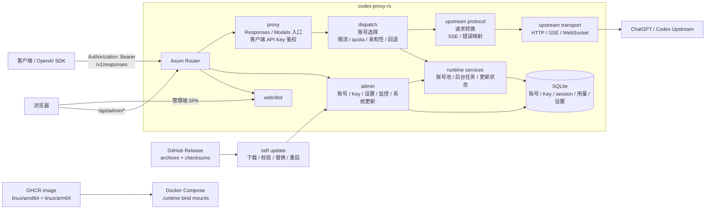

# Codex Proxy RS 架构

## 总览

Codex Proxy RS 是单进程应用。Rust 后端同时处理 Responses 兼容代理、管理端 API、SQLite 持久化、后台任务、静态前端托管和在线更新；Vue 管理端作为 SPA 由同一个进程托管。



## 仓库边界

- `backend/`：Rust/Axum 后端、SQLite migration、构建脚本和集成测试。
- `frontend/`：Vue 3 管理端，使用 Vite 8、Tailwind v4、Pinia、Vue Router、ECharts 和 lucide 图标。
- `deploy/`：Dockerfile、Compose 和 Docker 部署配置模板。
- `docs/`：长期维护文档，记录当前有效结构与决策。
- `release/`：版本号、平台矩阵和发布脚本。
- `skills/`：项目本地 Codex skill。

当前后端是 `backend/` 单 crate。历史迁移布局不再作为当前架构的一部分记录。

## 后端结构

入口：

- `backend/src/main.rs`：二进制入口。
- `backend/src/lib.rs`：集成测试和二进制共享的库入口。
- `backend/src/runtime/bootstrap.rs`：加载配置、初始化日志、连接数据库、构造服务、启动 HTTP。
- `backend/src/runtime/services.rs`：集中构造账号、模型、监控、更新等运行时服务。

主要模块：

- `admin/`：管理端 API，包括登录 session、账号、API Key、监控、运行设置和系统更新。
- `proxy/`：Responses/Models HTTP 入口、客户端 API Key 鉴权、请求分派。
- `proxy/openai/`：Responses 和 Models 的协议入口。
- `proxy/dispatch/`：账号选择、quota/限流处理、错误映射、session affinity 和失败回退。
- `upstream/`：ChatGPT/Codex 上游账号、模型、协议、传输、token 刷新和 fingerprint。
- `config/`：启动配置、运行时设置和管理端设置落库。
- `infra/`：SQLite、migration、日志、时间、格式化、JSON 和身份哈希。
- `http/`：router、中间件、可信代理和请求上下文。
- `web/`：前端静态资源和 SPA fallback。

测试统一放在 `backend/tests/`，不在 `backend/src/` 新增测试模块。

## 配置和运行时目录

启动配置由 `CPR_CONFIG_FILE` 指定；未指定时读取当前工作目录的 `config.yaml`。

配置文件只负责启动必需项：

- HTTP 监听。
- 上游 base URL。
- SQLite URL。
- 日志目录。
- 管理员首次初始化密码。
- TLS、WebSocket 池、quota 周期和 fingerprint 默认值。

账号、客户端 API Key、模型别名、账号选择策略和多数运行参数由管理端写入 SQLite。

`.runtime` 是本项目统一运行目录：

```text
.runtime/config.yaml
.runtime/data/codex-proxy-rs.sqlite
.runtime/data/installation_id
.runtime/data/update-state.json
.runtime/data/update.lock
.runtime/logs/
```

Docker 也使用宿主机 `.runtime`，但容器内配置路径仍然写 `/app/data` 和 `/app/logs`。Compose 默认映射：

```text
.runtime/config.yaml -> /app/config.yaml
.runtime/data        -> /app/data
.runtime/logs        -> /app/logs
```

容器以非 root 用户 `10001:10001` 运行。Compose 设置 `HOME=/app` 和 `XDG_DATA_HOME=/app/data`，确保 installation id、SQLite、更新状态和日志都写入可持久化目录。

## 代理请求链路

客户端请求进入 `/v1/responses`、`/v1/responses/review`、`/v1/responses/compact` 或 `/v1/models*`：

1. `proxy/auth` 校验客户端 API Key，并记录调用上下文。
2. `proxy/openai` 解析 Responses 或 Models 请求。
3. `proxy/dispatch` 按模型、quota、账号状态和选择策略挑选账号。
4. `upstream/protocol` 转换为 ChatGPT/Codex 上游协议。
5. `upstream/transport` 使用 HTTP、SSE 或 WebSocket 访问上游。
6. 响应和错误被转换回 OpenAI Responses/Models 兼容格式。
7. 用量、模型维度统计、请求记录、账号窗口和失败状态写回 SQLite/账号池。

账号状态由 SQLite 恢复到内存账号池，并在请求、token 刷新、quota 刷新、Cloudflare 处理和失败回退时同步更新。

## 管理端

管理端 API 位于 `/api/admin/*`，使用 session cookie 保护。前端由后端托管，不单独部署 Node 服务。

前端结构：

- `frontend/src/api/modules`：管理端 API 客户端。
- `frontend/src/components/base`：基础 UI 组件。
- `frontend/src/layout`：主布局、侧边栏和系统更新弹窗。
- `frontend/src/views`：业务页面。
- `frontend/src/stores`：Pinia 状态。
- `frontend/src/styles/tokens.css`：亮色/暗色主题 token。

管理端页面包括：

- 账号管理：导入、OAuth、连接测试、额度、模型、调度状态、刷新能力。
- API Key 管理：客户端 Key 和管理员 API Key。
- Dashboard：核心指标、请求趋势、账号概览、服务状态和健康时间线。
- 请求明细：网关调用、上游状态、Token 消耗、错误和详情。
- 设置：运行参数、模型映射、账号选择策略。
- 系统更新：版本、检查更新、SSE 更新日志、更新、重启、回滚。

## 发布

版本契约集中在 `release/`：

- `release/version.yaml`：当前产品版本。
- `release/platforms.yaml`：Release asset 和 Docker 平台矩阵。
- `release/publish`：更新版本文件、生成版本提交、创建 tag 并 push。

发布命令：

```bash
release/publish 1.0.4
```

发布 workflow 校验触发 tag 必须等于 `v` + `release/version.yaml`。构建时注入：

- `CPR_VERSION`
- `CPR_GIT_SHA`
- `CPR_BUILD_TIME`
- `CPR_BUILD_TYPE=release`

`backend/build/build.rs` 负责把这些值写入二进制。没有 `CPR_VERSION` 时，版本回落到 `release/version.yaml`，最后才回落到 Cargo 包版本。

Release 产物：

```text
codex-proxy-rs_<version>_linux_amd64.tar.gz
codex-proxy-rs_<version>_linux_arm64.tar.gz
codex-proxy-rs_<version>_darwin_arm64.tar.gz
codex-proxy-rs_<version>_windows_amd64.zip
checksums.txt
```

GHCR 镜像发布 `linux/amd64` 和 `linux/arm64` 多平台 manifest。发布 workflow 先在对应原生 runner 上构建平台镜像，再合并正式 manifest。Docker 在线更新使用的 Linux 二进制在 `rust:1.95-bookworm` 中构建，保持与 runtime 镜像的 glibc ABI 兼容。

## 在线更新

在线更新由主服务处理，没有独立 updater sidecar。

核心接口：

- `GET /api/admin/system/version`
- `GET /api/admin/system/update-detail`
- `GET /api/admin/system/update-events`
- `GET /api/admin/system/update-status`
- `POST /api/admin/system/update`
- `POST /api/admin/system/restart`
- `POST /api/admin/system/rollback`

更新流程：

1. 查询 GitHub Release。
2. 按当前 OS/arch 选择 asset，支持 `amd64/x86_64` 与 `arm64/aarch64` 命名。
3. 下载归档和 `checksums.txt`。
4. 校验 checksum。
5. 解压二进制和 `web/dist`。
6. 替换当前二进制和前端静态资源。
7. 写入 `.runtime/data/update-state.json`。
8. 通过 SSE 推送中文更新日志。
9. 管理端触发重启；Docker 模式依靠 `restart: unless-stopped` 拉起新容器进程，非 Docker 模式先安排新进程延迟启动，再关闭当前进程。

替换逻辑必须支持跨文件系统 fallback，因为容器环境中 `rename` 可能遇到 `Invalid cross-device link`。

## Docker

`deploy/Dockerfile` 的构建上下文是仓库根目录。

阶段：

- `frontend-builder`：安装前端依赖并构建 Vue SPA。
- `backend-builder`：构建 Rust release 二进制，不依赖前端 dist。
- `release-asset-builder` / `release-asset`：组合后端二进制和前端 dist，生成 GitHub Release 归档。
- `runtime-base`：Debian slim、CA、curl、非 root 用户、运行目录。
- `runtime`：从源码构建出的运行镜像。
- `runtime-prebuilt`：发布 workflow 使用的预构建二进制镜像阶段。

Compose 默认：

- 镜像：`ghcr.io/zyycn/codex-proxy-rs:latest`，可用 `CPR_IMAGE` 覆盖。
- 端口：`127.0.0.1:8080:8080`。
- 数据：`.runtime/data:/app/data`。
- 日志：`.runtime/logs:/app/logs`。
- 配置：`.runtime/config.yaml:/app/config.yaml:ro`。
- 更新：`CPR_UPDATE_REPOSITORY=zyycn/codex-proxy-rs`，`CPR_ENABLE_SELF_RESTART=true`。

## CI

常规 CI 位于 `.github/workflows/ci.yml`：

- Rust fmt、clippy 和集成测试。
- 前端 install、typecheck/build。
- Docker Compose 配置校验。
- Runtime image build。

安全扫描位于 `.github/workflows/security-scan.yml`：

- `cargo audit`。
- `pnpm audit --prod --audit-level=high`。
- Docker runtime image security scan。

发布流程位于 `.github/workflows/release.yml`，由 `v*` tag 或手动指定 tag 触发。
