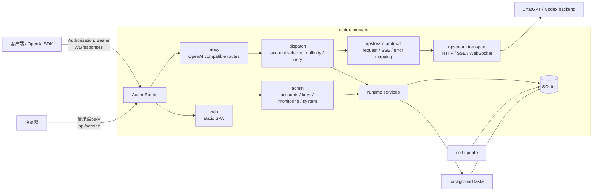

# Codex Proxy RS 架构

## 总览

Codex Proxy RS 是一个单进程代理和管理系统。Rust 后端同时承载 OpenAI Responses 兼容代理、管理端 API、SQLite 持久化、后台任务、静态前端托管和在线更新；Vue 管理端作为 SPA 由同一个进程托管。



核心原则：

- 启动配置只负责进程启动必需项。
- 账号、Key、模型别名和运行参数保存在 SQLite，并通过管理端热更新。
- 代理热路径只依赖运行时内存服务，持久化写入在请求完成、后台任务或设置更新时同步。
- 上游请求统一经过账号池、session affinity、quota、fingerprint 和 transport 层。

## 仓库边界

- `backend/`：Rust/Axum 后端、SQLite migration、构建脚本和集成测试。
- `frontend/`：Vue 3 管理端，使用 Vite、Pinia、Vue Router、ECharts 和 lucide 图标。
- `deploy/`：Dockerfile、Compose 和部署配置模板。
- `docs/`：长期维护文档。
- `release/`：版本号、平台矩阵和发布脚本。
- `skills/`：项目本地 Codex skill。

测试统一放在 `backend/tests/`，不在 `backend/src/` 新增测试模块。

## 后端结构

入口和组合层：

- `backend/src/main.rs`：二进制入口。
- `backend/src/lib.rs`：二进制和集成测试共享入口。
- `runtime/bootstrap.rs`：加载配置、初始化日志、连接 SQLite、构造服务、恢复运行时状态并启动 HTTP。
- `runtime/services.rs`：集中构造账号、模型、监控、更新、fingerprint、WebSocket 池等服务。
- `runtime/tasks/`：后台任务协调和周期任务。

主要业务模块：

- `admin/`：管理端 API，包括登录 session、账号、API Key、监控、设置和系统更新。
- `proxy/`：OpenAI 兼容路由、客户端 API Key 鉴权和请求分派。
- `proxy/openai/`：Responses、review、compact、Models 的 HTTP 入口。
- `proxy/dispatch/`：账号选择、session affinity、quota 验证、历史恢复、错误映射、用量记录。
- `upstream/accounts/`：账号模型、账号池、导入、Cookie、quota、token refresh、SQLite store。
- `upstream/models/`：模型目录、模型别名、模型计划快照。
- `upstream/protocol/`：Responses 请求、SSE、WebSocket 事件和错误转换。
- `upstream/transport/`：Reqwest、TLS、WebSocket、WebSocket pool、fingerprint 请求头。
- `config/`：启动配置 schema、运行时设置和数据库设置加载。
- `infra/`：SQLite、migration、日志、时间、JSON、格式化和身份哈希。
- `http/`：router、中间件、可信代理和请求上下文。
- `web/`：前端静态资源和 SPA fallback。

## 配置

启动配置由 `CPR_CONFIG_FILE` 指定；未指定时读取当前工作目录的 `config.yaml`。

配置文件字段：

- `server`：监听地址、端口、可信代理。
- `api`：上游 base URL。
- `database`：SQLite URL。
- `tls`：HTTP/TLS 偏好。
- `ws_pool`：WebSocket 连接池和首内容帧超时。
- `quota`：quota 刷新周期和是否跳过耗尽账号。
- `fingerprint`：默认 Codex Desktop 指纹和请求头。
- `admin`：管理员首次初始化和 session 清理配置。
- `logging`：日志目录、保留期和使用记录开关。

运行时设置保存在 `runtime_settings`：

- `modelAliases`
- `refreshMarginSeconds`
- `refreshConcurrency`
- `maxConcurrentPerAccount`
- `requestIntervalMs`
- `rotationStrategy`

这些设置由管理端更新，并同步到账号池、token refresh 策略和模型服务。

## 运行目录

`.runtime` 是默认运行目录：

```text
.runtime/config.yaml
.runtime/data/codex-proxy-rs.sqlite
.runtime/data/installation_id
.runtime/data/update-state.json
.runtime/data/update.lock
.runtime/logs/
```

Docker 默认映射：

```text
.runtime/config.yaml -> /app/config.yaml
.runtime/data        -> /app/data
.runtime/logs        -> /app/logs
```

容器以非 root 用户 `10001:10001` 运行。Compose 设置 `HOME=/app` 和 `XDG_DATA_HOME=/app/data`，确保 installation id、SQLite、更新状态和日志写入持久化目录。

## SQLite

当前 schema 由 `backend/src/infra/migrations` 管理。

核心表：

- `admin_users`、`admin_sessions`：管理端账号和 session。
- `client_api_keys`：客户端 API Key。
- `runtime_settings`：管理端运行设置。
- `accounts`：账号身份、token、状态、quota、fingerprint 关联信息。
- `account_usage`：账号累计用量和当前 quota 窗口用量。
- `account_model_usage`：账号和模型维度的请求、错误和 token 用量。
- `account_refresh_leases`：token refresh 分布式租约。
- `account_cookies`：账号 Cookie。
- `fingerprints`、`fingerprint_update_history`：当前指纹和更新历史。
- `usage_records`：网关和上游事件明细。
- `usage_time_buckets`：15 分钟聚合桶，供 Dashboard 和趋势接口使用。
- `model_plan_snapshots`：模型到账号计划的可用性快照。
- `session_affinities`：response ID、conversation、账号、turn state 和 function call 关联。

## 代理入口

客户端请求入口：

- `POST /v1/responses`
- `POST /v1/responses/review`
- `POST /v1/responses/compact`
- `GET /v1/models`
- `GET /v1/models/{model}`

请求链路：

1. HTTP 中间件生成 request id、记录访问日志、解析可信代理 IP。
2. `proxy/auth` 校验客户端 API Key。
3. `proxy/openai` 解析 OpenAI compatible 请求。
4. `proxy/dispatch` 构造账号获取请求，处理 session affinity 和隐式续写。
5. 账号池按模型、账号状态、quota、Cloudflare、并发槽和策略选择账号。
6. `upstream/protocol` 转为 Codex backend 请求。
7. `upstream/transport` 选择 HTTP、SSE 或 WebSocket 访问上游。
8. 响应被转换回 OpenAI Responses/Models 格式。
9. 请求记录、账号用量、模型用量、quota header、Cookie、turn state 和 session affinity 写回运行时和 SQLite。

## 账号调度

账号池位于 `upstream/accounts/pool.rs`。调度前先做硬过滤：

- 账号状态必须是 `active`。
- 模型必须被账号计划允许。
- quota 必须可用。
- Cloudflare 冷却必须结束。
- 账号不在本次请求排除列表。
- 当前在途槽位小于 `maxConcurrentPerAccount`。

策略：

- `smart`：默认策略。按账号实时负载选择账号，依次比较当前在途槽位数、窗口请求数、窗口 token 数和历史请求数；负载相同，再参考额度窗口重置时间和最近使用时间。
- `quota_reset_priority`：按额度窗口重置时间选择账号，优先使用更早重置的窗口；重置时间相同，再比较历史请求数和最近使用时间。
- `round_robin`：按候选账号顺序循环选择。
- `sticky`：按最近使用时间优先选择。

请求带有 `required_account_id` 时只尝试该账号。请求带有 session affinity 的 `preferred_account_id` 时，只有该账号仍在硬过滤结果中才会命中，否则回到当前调度策略。选中账号后立即占用在途槽位，释放时记录请求用量并更新窗口计数。

## Session Affinity

Session affinity 由 `proxy/dispatch/session_affinity.rs` 和 `proxy/dispatch/responses/affinity.rs` 维护。

存储内容：

- response id。
- conversation id。
- account id。
- prompt/instructions 变体。
- turn state。
- function call ids。
- 输入 token。
- 过期时间。

行为：

- 请求显式携带 `previous_response_id` 时，优先查找该 response 对应账号。
- 请求没有 `previous_response_id` 但满足隐式续写条件时，按 conversation 查找最新 response 并补充上下文。
- 当亲和账号不可用并切换到其它账号时，按请求类型和失败类型处理历史字段。
- 上游返回 `previous_response_not_found`、未闭合 function call 等历史错误时，恢复请求历史并重试。
- 成功响应会记录新的 response affinity，供后续请求继续使用。

## Quota 和账号状态

账号状态包括：

- `active`
- `expired`
- `quota_exhausted`
- `refreshing`
- `disabled`
- `banned`

quota 数据来源：

- 管理端主动刷新账号 quota。
- 后台 quota refresh 周期任务。
- 上游 rate-limit header 被动同步。
- 请求中遇到 429/限额错误时标记冷却。

quota 运行态字段包括 `quota_json`、`quota_fetched_at`、`quota_limit_reached`、`quota_verify_required`、`quota_cooldown_until`、当前窗口计数、窗口开始时间、窗口重置时间和窗口长度。

当 quota 冷却或窗口到期时，账号会恢复为可验证状态，并在下次使用前执行 quota verify。验证通过后继续使用；验证仍为耗尽时继续冷却或切换账号。

## Token Refresh

token refresh 由 `RuntimeTokenRefreshService` 和 `runtime/tasks/token_refresh.rs` 执行。

行为：

- 按 `refreshMarginSeconds` 判断 access token 是否需要提前刷新。
- 用 `refreshConcurrency` 控制刷新并发。
- 使用 `account_refresh_leases` 避免多任务重复刷新同一账号。
- refresh token 缺失、失效、复用或账号被封禁时更新账号状态。
- 设置更新后刷新策略热生效。

## WebSocket Transport

Responses 请求可通过 WebSocket 访问上游 `/codex/responses`。WebSocket 层负责：

- 构造 opening handshake 和首个 `response.create` 文本帧。
- 将上游 WebSocket 事件转换为 SSE。
- 聚合非流式响应或转发流式响应。
- 解析上游错误帧、`response.incomplete`、rate-limit 事件和 metadata turn state。
- 记录首内容帧延迟、WebSocket pool 决策和上游诊断信息。

WebSocket pool 配置：

- `enabled`：是否启用连接池。
- `max_age_ms`：连接最大生命周期。
- `max_per_account`：单账号池 slot 上限。
- `first_token_timeout_ms`：发出 `response.create` 后等待首个内容帧的绝对超时；`0` 表示禁用。

池行为：

- pool key 由 base URL、账号 ID 和 conversation ID 组成。
- idle 连接按 key 复用，busy 连接会让请求绕过池新建连接。
- idle 连接由后台 pump 做 ping/pong 和关闭检测。
- 连接超过 max age、被 pump 标记关闭、账号被驱逐或请求失败时丢弃。
- 复用连接在首内容帧前失效时，丢弃连接并换新连接。
- fresh 连接首内容帧超时时，丢弃当前连接并按配置重试。
- 流式请求在返回下游前会预取到首个内容帧；这样首内容帧超时可以在响应开始前完成换连接。

## Fingerprint

fingerprint 位于 `upstream/fingerprint.rs`。运行时持有一个 `RuntimeFingerprint` 快照，上游请求从该快照生成 Codex Desktop 风格请求头。

数据来源：

- `config.yaml` 中的默认 fingerprint。
- SQLite 中的当前 fingerprint。
- 后台 fingerprint update 任务。

启动时会用配置默认值初始化缺失的当前 fingerprint。后台任务从 Codex Desktop appcast 获取版本信息，更新 SQLite 中的 current fingerprint，并替换运行时快照。更新后的请求使用最新 fingerprint。

## 后台任务

后台任务由 `runtime/tasks/coordinator.rs` 统一启动和关闭：

- `cookie_cleanup`：清理过期 Cookie。
- `session_cleanup`：清理过期管理端 session。
- `session_affinity_cleanup`：清理过期 session affinity。
- `model_refresh`：按账号计划刷新模型列表和模型计划快照。
- `token_refresh`：刷新即将过期的 access token。
- `quota_refresh`：主动刷新账号 quota，并同步账号池状态。
- `fingerprint_update`：更新 Codex Desktop fingerprint。
- `websocket_pool`：关闭阶段统一 shutdown WebSocket pool。

周期任务通过统一 runner 管理 shutdown 信号和超时退出。

## 监控和用量

请求完成后写入：

- `usage_records`：请求、上游尝试、状态码、失败分类、延迟、metadata。
- `usage_time_buckets`：按中国时区 15 分钟槽聚合请求数、错误数、token、缓存、首内容帧延迟和总延迟。
- `account_usage`：账号累计用量和当前 quota 窗口用量。
- `account_model_usage`：账号和模型维度用量。

Dashboard：

- `/api/admin/dashboard/summary`
- `/api/admin/dashboard/trend?kind=usage|latency|errors`

Dashboard 的今日指标、趋势和健康时间线按中国自然日计算。账号容量、账号状态、服务状态和调度策略取当前运行时状态。累计请求、累计 token、累计缓存和累计命中率来自账号用量汇总。

请求明细：

- `/api/admin/usage/records`
- `/api/admin/usage/records/summary`
- `/api/admin/usage/records/detail`
- `/api/admin/usage/records/insights/models`
- `/api/admin/usage/records/insights/endpoints`
- `/api/admin/usage/records/insights/token-trend`
- `/api/admin/usage/records/insights/latency-trend`
- `/api/admin/usage/records/delete`

## 管理端 API

管理端 API 位于 `/api/admin/*`，使用管理员 session cookie 保护。

主要路由：

- Auth：`/api/admin/login`、`/api/admin/auth/status`、`/api/admin/logout`。
- Settings：`/api/admin/settings`、`/api/admin/settings/admin-api-key`。
- System：`/api/admin/system/version`、`/api/admin/system/update-detail`、`/api/admin/system/update-events`、`/api/admin/system/update-status`、`/api/admin/system/update`、`/api/admin/system/restart`、`/api/admin/system/rollback`。
- Dashboard：`/api/admin/dashboard/summary`、`/api/admin/dashboard/trend`。
- Accounts：`/api/admin/accounts`、`/api/admin/accounts/import`、`/api/admin/accounts/export`、`/api/admin/accounts/oauth/*`、`/api/admin/accounts/test`、`/api/admin/accounts/models`、`/api/admin/accounts/refresh`、`/api/admin/accounts/health-check`、`/api/admin/accounts/quota`。
- Usage Records：`/api/admin/usage/records*`。
- API Keys：`/api/admin/keys`、`/api/admin/keys/update`、`/api/admin/keys/delete`。

## 前端

前端由后端托管，不单独部署 Node 服务。

结构：

- `frontend/src/api/modules`：管理端 API 客户端。
- `frontend/src/components/base`：基础 UI 组件。
- `frontend/src/layout`：主布局、侧边栏和系统更新弹窗。
- `frontend/src/views`：业务页面。
- `frontend/src/stores`：Pinia 状态。
- `frontend/src/styles/tokens.css`：亮色/暗色主题 token。

主要页面：

- 首页 Dashboard。
- 账号管理。
- API Key 管理。
- 请求明细。
- 系统设置。
- 系统更新。

## 在线更新

在线更新由主服务处理，没有独立 updater sidecar。

流程：

1. 查询 GitHub Release。
2. 按当前 OS/arch 选择 asset。
3. 下载归档和 checksum 文件。
4. 校验 checksum。
5. 解压后端二进制和 `web/dist`。
6. 替换当前二进制和前端静态资源。
7. 写入 `.runtime/data/update-state.json`。
8. 通过 SSE 推送中文更新日志。
9. 管理端触发重启。

Docker 模式依靠 `restart: unless-stopped` 拉起新进程。非 Docker 模式会安排新进程延迟启动，再关闭当前进程。

## Docker

`deploy/Dockerfile` 的构建上下文是仓库根目录。

阶段：

- `frontend-builder`：安装前端依赖并构建 Vue SPA。
- `backend-builder`：构建 Rust release 二进制。
- `release-asset-builder` / `release-asset`：组合后端二进制和前端 dist，生成 GitHub Release 归档。
- `runtime-base`：Debian slim、CA、curl、非 root 用户和运行目录。
- `runtime`：源码构建运行镜像。
- `runtime-prebuilt`：发布 workflow 使用的预构建二进制镜像阶段。

Compose 默认：

- 镜像：`ghcr.io/zyycn/codex-proxy-rs:latest`，可用 `CPR_IMAGE` 覆盖。
- 端口：`127.0.0.1:8080:8080`。
- 数据：`.runtime/data:/app/data`。
- 日志：`.runtime/logs:/app/logs`。
- 配置：`.runtime/config.yaml:/app/config.yaml:ro`。
- 更新：`CPR_UPDATE_REPOSITORY=zyycn/codex-proxy-rs`，`CPR_ENABLE_SELF_RESTART=true`。

## 发布

版本文件：

- `release/version.yaml`
- `release/platforms.yaml`

发布命令：

```bash
release/publish <version>
```

发布 workflow 校验触发 tag 必须等于 `v` + `release/version.yaml`。

构建时注入：

- `CPR_VERSION`
- `CPR_GIT_SHA`
- `CPR_BUILD_TIME`
- `CPR_BUILD_TYPE=release`

Release 产物按 `release/platforms.yaml` 生成 Linux、Darwin 和 Windows 包。GHCR 镜像发布 `linux/amd64` 和 `linux/arm64` 多平台 manifest。

## CI

常规 CI 位于 `.github/workflows/ci.yml`：

- Rust fmt、clippy 和集成测试。
- 前端 install、typecheck/build。
- Docker Compose 配置校验。
- Runtime image build。

安全扫描位于 `.github/workflows/security-scan.yml`：

- `cargo audit`。
- `pnpm audit --prod --audit-level=high`。
- Docker runtime image security scan。

发布流程位于 `.github/workflows/release.yml`，由 `v*` tag 或手动指定 tag 触发。
