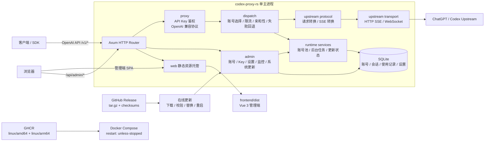

# Codex Proxy RS 架构说明

## 总览

Codex Proxy RS 是一个单主服务应用：Rust 后端提供 OpenAI 兼容代理、管理端 API、SQLite 持久化、静态前端托管和在线更新能力；Vue 管理端作为 SPA 由同一个后端进程托管。



## 仓库边界

- `backend/`：Rust/Axum 后端、SQLite schema、运行时服务、集成测试和 Cargo 构建脚本。
- `frontend/`：Vue 3 管理端，使用 Vite、Tailwind v4、Pinia、Vue Router 和 ECharts。
- `deploy/`：Dockerfile、Compose 文件、Docker ignore 文件和部署样例配置。
- `docs/`：长期维护文档，只记录当前真实架构和约定，不保留迁移过程作为开发约束。
- `skills/`：项目本地 Codex skill。

## 后端结构

后端入口是 `backend/src/main.rs`，公共库入口是 `backend/src/lib.rs`。运行时由 `runtime::bootstrap` 初始化，服务集合在 `runtime::services` 构造，并通过 `AppState` 注入到路由。

主要模块：

- `admin/`：管理端 API，包括认证、账号、API Key、监控、设置和系统更新。
- `proxy/`：OpenAI 兼容代理入口、鉴权、请求转换和账号调度。
- `upstream/`：ChatGPT/Codex 上游协议、传输层、账号模型、token 刷新、quota 刷新和 fingerprint。
- `config/`：配置加载、运行时设置和配置类型。
- `infra/`：数据库、日志、时间、格式化、JSON 和 schema。
- `http/`：HTTP router、中间件和统一请求上下文。
- `web/`：前端静态资源和 SPA fallback 托管。

测试只放在 `backend/tests/`，不要在 `backend/src/` 中新增测试模块。

## 数据和运行时

后端以 SQLite 作为主要持久化存储。默认运行时数据位于 `.runtime/`，Docker 部署时通过 Compose 挂载到 `/app/data` 和 `/app/logs`。

运行时状态分两类：

- 持久化状态：账号、cookie、API Key、session、使用记录、时间桶、fingerprint、运行时设置等。
- 内存状态：账号池、调度状态、运行中任务、SSE 更新日志广播、缓存的 release 检查结果等。

运行时设置通过管理端 API 修改后写入数据库，并同步到内存服务。

## 代理请求链路

客户端请求进入 `/v1/*`：

1. `proxy/auth` 校验客户端 API Key。
2. `proxy/openai` 解析 OpenAI 兼容请求。
3. `proxy/dispatch` 选择账号、处理限流、亲和性和失败回退。
4. `upstream/protocol` 转换 Codex/ChatGPT 上游协议。
5. `upstream/transport` 使用 HTTP SSE 或 WebSocket 访问上游。
6. 响应被转换回 OpenAI 兼容格式，并记录使用数据。

账号运行时状态由 SQLite 快照恢复，并在请求、刷新、quota 检查和失败回退时更新。

## 管理端

管理端 API 位于 `/api/admin/*`，使用 session cookie 保护。前端入口由后端托管，不单独部署 Node 服务。

前端结构：

- `frontend/src/api/modules`：管理端 API 客户端。
- `frontend/src/components/base`：基础 UI 组件。
- `frontend/src/layout`：主布局、侧边栏、系统更新入口和更新弹窗。
- `frontend/src/views`：各业务页面。
- `frontend/src/stores`：Pinia 状态。
- `frontend/src/styles/tokens.css`：亮色/暗色主题 token。

前端只展示后端返回的版本、状态和更新日志，不在前端做状态文案映射。

## 版本和发布

版本只有两个来源层级：

- 源码默认版本：`backend/Cargo.toml` 的 `[package].version`。
- 发布版本：Git tag 去掉 `v` 前缀后得到的版本。

发布 workflow 会校验 tag 版本必须等于 `backend/Cargo.toml` 的 package version。发布构建时通过 `CPR_VERSION`、`CPR_GIT_SHA`、`CPR_BUILD_TIME` 和 `CPR_BUILD_TYPE=release` 注入编译期元数据。

`backend/build/build.rs` 负责把这些值写入二进制。没有 `CPR_VERSION` 时，版本回落到 Cargo 的 `CARGO_PKG_VERSION`。不要重新引入独立 `VERSION` 文件。

GitHub Release 产物：

```text
codex-proxy-rs_<version>_linux_amd64.tar.gz
codex-proxy-rs_<version>_linux_arm64.tar.gz
checksums.txt
```

GHCR 镜像发布为 `linux/amd64` 和 `linux/arm64` 多平台 manifest。

## 在线更新

在线更新由主服务自己处理，不依赖独立 updater sidecar。核心接口：

- `GET /api/admin/system/version`
- `GET /api/admin/system/check-updates`
- `GET /api/admin/system/update-events`
- `GET /api/admin/system/update-status`
- `POST /api/admin/system/update`
- `POST /api/admin/system/restart`

更新流程：

1. 后端检查 GitHub latest release。
2. 按当前 OS/arch 选择匹配 asset，兼容 `amd64/x86_64` 和 `arm64/aarch64` 命名。
3. 下载 release tar 包并用 `checksums.txt` 校验。
4. 解压二进制和 `web/dist`。
5. 替换当前二进制和前端静态资源。
6. 前端通过 SSE 实时展示后端推送的中文更新日志。
7. Docker 部署依靠 `restart: unless-stopped` 在自重启后拉起新进程。

替换逻辑必须支持跨文件系统 fallback，因为容器文件系统里 `rename` 可能遇到 `Invalid cross-device link`。

## Docker 部署

Docker 构建入口是 `deploy/Dockerfile`，上下文保持仓库根目录。

构建阶段：

- `frontend-builder`：构建 Vue SPA。
- `backend-builder`：构建 Rust release 二进制，并复制前端 dist。
- `release-asset`：导出 GitHub Release tar 包。
- `runtime`：最小运行镜像，基于 `debian:bookworm-slim`，只包含 CA、后端二进制和 `web/dist`。

Compose 文件是 `deploy/docker-compose.yml`。示例配置只保留 `deploy/config.example.yaml`，用户复制为 `deploy/config.yaml` 后部署。

## CI 和安全扫描

常规 CI 位于 `.github/workflows/ci.yml`：

- Rust fmt、clippy、集成测试。
- 前端依赖安装和 build。
- Compose 配置校验。

安全扫描位于 `.github/workflows/security-scan.yml`：

- `cargo audit` 扫描 Rust 依赖。
- `pnpm audit --prod --audit-level=high` 扫描前端生产依赖。
- 每周定时运行，同时覆盖 push 和 pull request。

发布流程位于 `.github/workflows/release.yml`，只由 `v*` tag 或手动指定 tag 触发。
