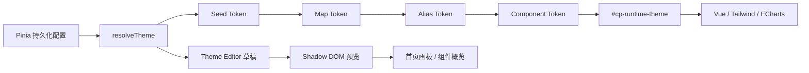

<!-- prettier-ignore -->
<div align="center">


# 管理端主题系统

**基于 Seed、Map、Alias 与 Component Token 的运行时主题架构**

[设计原则](#设计原则) · [Token 模型](#token-模型) · [运行时架构](#运行时架构) · [主题编辑器](#主题编辑器) · [扩展指南](#扩展指南)

</div>

主题系统为 Codex Proxy RS 管理端提供浅色、深色、预置配色与自定义配色能力。颜色 Map 复用 Ant Design 的
Token 分层、十阶色板与明暗角色映射，中性 Surface 由背景和文字 Seed 统一派生；不引入 `antd`、React、`ConfigProvider`
或 CSS-in-JS，Vue 组件继续通过 CSS Variables 与 Tailwind CSS 4 utilities 消费主题。

> [!IMPORTANT]
> 主题的目标是调整颜色、密度、圆角与层级，不改变现有页面结构和产品语义。默认主题必须保持既有视觉基线，
> 成功、警告、错误和业务数据色不会因为品牌色变化而失去原有含义。

## 设计原则

- **Seed 与 Map 可追踪**：主色和功能色均按 Ant Design 从 Seed 派生 P1-P10；浅色 P6 等于 Seed，深色 P6
  经过暗色色板适配。编辑器同时展示 Seed 与最终 Map，不在中途隐式改色。
- **主色与表面分离**：品牌色负责交互和强调，页面、容器、浮层与文字由独立的背景和文本 Seed 派生。
- **语义独立**：`success`、`warning`、`error`、`info` 与 `link` 不随品牌色隐式改变；未显式配置 `link`
  时按 Ant Design 回退到 `info`。
- **无边设计**：默认依靠表面色差、间距和轻阴影表达层级；边框只用于焦点、错误和必要分隔。
- **运行时可定制**：用户输入在浏览器中实时派生，因此使用 CSS Variables，不使用构建时 SCSS 变量。
- **单一事实源**：Store 只保存最小配置，所有 Map、Alias 与未覆盖的 Component Token 均由纯函数生成。
- **行为透明**：任意自定义 Seed 都直接进入公开算法，不追加页面或组件级修色；彩色文字 Alias 统一依据当前
  Container Surface 做对比度保护，交互仍尊重 `prefers-reduced-motion`。

## 架构概览



核心职责保持分离：

| 层 | 文件 | 职责 |
| --- | --- | --- |
| 公开入口 | [`theme/index.ts`](../frontend/src/theme/index.ts) | 只汇总稳定的外部 API，不承载实现 |
| 领域类型 | [`theme/types.ts`](../frontend/src/theme/types.ts) | 唯一类型文件，包含持久化模型、解析结果与内部 Map 契约 |
| 设计输入 | [`theme/core/constants.ts`](../frontend/src/theme/core/constants.ts) | 默认 Seed、预置主题元数据、尺寸与可编辑白名单 |
| 颜色算法 | [`theme/core/color.ts`](../frontend/src/theme/core/color.ts) | Ant Design 色板角色、色调混合、透明度与对比度 |
| Map 派生 | [`theme/derive/colors.ts`](../frontend/src/theme/derive/colors.ts) | Surface、Primary、Semantic、Preset 与数据色 Map |
| Component 派生 | [`theme/derive/components.ts`](../frontend/src/theme/derive/components.ts) | 尺寸、阴影和 Component Token Map |
| 输入边界 | [`theme/core/normalize.ts`](../frontend/src/theme/core/normalize.ts) | 持久化配置与直接覆盖值的规范化 |
| 解析编排 | [`theme/core/resolve.ts`](../frontend/src/theme/core/resolve.ts) | 串联 Seed → Map → Alias → Component |
| Token 编译 | [`theme/core/tokens.ts`](../frontend/src/theme/core/tokens.ts) | 从类型化 Map 和短角色表生成 CSS Variables |
| 浏览器适配 | [`theme/runtime/browser.ts`](../frontend/src/theme/runtime/browser.ts) | 将解析结果提交为根作用域运行时样式表 |
| 状态 | [`stores/modules/theme.ts`](../frontend/src/stores/modules/theme.ts) | 持久化配置、系统明暗偏好、切换动作与动画 |
| 编辑器状态 | [`useThemeEditor.ts`](../frontend/src/views/theme/composables/useThemeEditor.ts) | 草稿、修改计数、恢复与保存 |
| 样式桥接 | [`styles/index.css`](../frontend/src/styles/index.css) | 将 CSS Token 暴露为 Tailwind CSS 4 utilities |
| 样式基线 | [`styles/base.css`](../frontend/src/styles/base.css) | 通过 `@layer base` 提供浏览器基线，通过 `@utility` 提供通用原生滚动条 |
| 静态基元 | [`styles/tokens.css`](../frontend/src/styles/tokens.css) | 只保留白色、透明色和作用域 `color-scheme` |

`theme/` 根目录只保留公开入口 `index.ts` 和唯一类型文件 `types.ts`；内部实现按 `core/`、`derive/`、`runtime/` 分层，不增加嵌套 barrel。
纯派生模块不访问 DOM，`theme/runtime/browser.ts` 不包含派生规则，Theme Store 不复制算法。
普通 Map 字段按 camelCase → kebab-case 统一生成 `--cp-*`；Semantic 与 Preset Color 仅维护各自的短角色表。
`ThemeTokenName` 在 `types.ts` 中由 Map 契约推导，新增字段不再要求同步手写大段联合类型和对象映射。

## Token 模型

主题采用四层模型：

```text
Seed Token → Map Token → Alias Token → Component Token
```

### Seed Token

Seed 是用户配置与持久化的最小事实：

```ts
type ThemeMode = 'system' | 'light' | 'dark'
type ThemeColorId = 'relay-blue' | 'deep-teal' | 'signal-violet' | 'graphite' | 'custom'

interface ThemeCustomization {
  seed?: Partial<ThemeSeedOverrides>
  component?: Partial<ThemeComponentOverrides>
  tokenOverrides?: Partial<ThemeTokens>
}
```

| 类别 | Seed |
| --- | --- |
| 品牌 | `colorPrimary`，由预置 ID 或自定义 HEX 提供 |
| 功能色 | `colorSuccess`、`colorWarning`、`colorError`、`colorInfo`、`colorLink` |
| 中性色 | `colorTextBase`、`colorBgBase` |
| 尺寸 | `fontSize`、`sizeUnit`、`sizeStep`、`controlHeight` |
| 风格 | `borderRadius`、`shadowStrength` |
| 组件尺寸 | `tableRowHeight`、`cardBorderRadius` |

持久化键为 `codex-proxy-rs-theme`。Store 不保存完整色板或 CSS Variables，损坏的模式、颜色与自定义值会在
初始化时规范化并回退到默认配置。

### Map Token

品牌色和功能色使用 `@ant-design/colors` 从一个 Seed 生成十阶色板，再复刻 Ant Design 的 Map 角色映射：

| 角色 | 规则 |
| --- | --- |
| 弱背景 | P1 / P2 |
| 描边 | P3 / P4 |
| Hover / Base / Active | P5 / P6 / P7 |
| Text Hover / Text / Text Active | P8 / P9 / P10 |

功能色的 Background、Border、Hover、Base、Active 与 Text 统一消费 Ant Design 明暗算法已经映射好的
P1-P10 角色：Base 固定 P6，Active 使用 P7，Success、Warning、Info 的 Hover 使用 P4，Error Hover 使用 P5，
Text 使用 P8 / P9 / P10。彩色文字只额外保证相对 Container Surface 至少 4.5:1 的对比度，不再二次改写暗色色阶。

分类、图表与数据强调继续使用 Ant Design Preset Color 的角色结构。Blue、Green、Orange、Red 分别复用
`colorInfo`、`colorSuccess`、`colorWarning`、`colorError`，保证通用彩色与可编辑语义 Seed 同源；没有语义对应的
Cyan、Purple 从 `@ant-design/colors` 的 `presetPrimaryColors` 取得 Seed。
P1 / P2 / P3 / P6 / P7 分别映射弱背景、较强背景、边界、实心色和文字；文字只按实际 Surface 做统一的
4.5:1 对比度校正，不再针对暗色模式升阶或插值。

背景与文本 Seed 进入独立的 Surface Map，生成：

- `colorBgLayout / Container / Elevated / Spotlight / Mask`
- `colorFillSecondary / Tertiary / Quaternary`
- `colorText / Heading / Secondary / Tertiary / Quaternary / Disabled`
- `colorBorder / BorderSecondary / Split / Shadow`

中继蓝使用稳定的浅色 / 深色中性基线；深海青、古风色与石墨预置额外提供各自的 `colorBgBase`、`colorTextBase`
画像，自定义主色则只向通用中性基线注入少量色温。Surface 使用 `@ant-design/fast-color` 从背景明度向文字 Seed
插值，并保留受限的文本色相：浅色层级随深度降低色度，避免白色背景经 RGB 混合退化为无色灰；深色层级按 Fill、
Border、Muted Text 的职责收敛色度。稳定锚点位于 Map、Component 与 Shadow 派生层，并按外观距离连续过渡；
所有预置、自定义 Seed 和用户覆盖仍进入同一条算法，不在页面或组件中追加 HEX 特判。
Input、阴影与其他 Component Token 继续从 Surface、Primary 和 Semantic Map 派生，不在常量文件维护整套颜色表。

### Alias Token

Alias 按视觉角色命名，使用 `--cp-` 命名空间，并优先对齐 Ant Design 的公开 Token 词汇：

| 角色 | CSS Token | 主要消费者 |
| --- | --- | --- |
| 品牌交互 | `--cp-color-primary*` | 主操作、选中态、焦点与强调 |
| 链接 | `--cp-color-link*` | 普通文本链接 |
| 表面 | `--cp-color-bg-*` | 页面、容器、浮层和遮罩 |
| 填充 | `--cp-color-fill-*` | 轨道、弱背景和静态层级 |
| 文字 | `--cp-color-text*` | 标题、正文和辅助信息 |
| 选择 | `--cp-control-item-bg-active*` | Segmented、Select 和选择控件 |
| 焦点 | `--cp-control-outline` | 键盘焦点和输入反馈 |
| 功能色 | `--cp-color-info / success / warning / error-*` | 系统反馈与状态 |
| 预设彩色 | `--cp-color-{blue,cyan,green,orange,purple,red}-{bg,bg-strong,border,solid,text,text-on-bg}` | 分类标签与数据强调 |

Alias 不对单个页面或组件追加修色；只有彩色文字统一执行 4.5:1 对比度保护。和 Ant Design 一样，Component
Token 直接覆盖时不会自动重算同组件的其他状态；需要保持梯度关系时应修改 Seed，而不是逐个覆盖 Map Token。

### Component Token

当组件需要独立演进时，使用 `component[-part][-variant][-state]-property` 命名，不创造含义重复的全局别名。

| 组件 | 代表 Token |
| --- | --- |
| Button | `--cp-button-primary-color / bg / hover-bg / active-bg` |
| Input | `--cp-input-bg / hover-bg / active-bg / error-active-bg` 与对应 Shadow |
| Menu | `--cp-menu-item-selected-bg` |
| Table | `--cp-table-row-bg / stripe-bg / hover-bg / selected-bg / height` |
| Card | `--cp-card-bg / border-radius / shadow` |
| Layout | `--cp-layout-sider-bg / shadow` |
| Scrollbar | `--cp-scrollbar-thumb-bg / hover-bg` |
| BrandMark | `--cp-brand-mark-bg` |

Theme Editor 只开放真正由对应组件消费的 Component Token。全局 Alias 不放进组件目录，避免一次覆盖同时改变
多个无关组件。

应用内品牌图标使用 [`AppBrandMark.vue`](../frontend/src/components/AppBrandMark.vue)：浅色模式取
`colorBgSpotlight`，深色模式取 `colorBgElevated`，保持中性暗面与白色图形；浏览器 favicon 继续使用固定黑白
图标，不随主题改变。

### 通用颜色消费

主题层禁止声明账号套餐、推理类型或具体页面名称。业务组件只能选择通用 Preset Color 角色，例如 Cyan 弱背景、
Purple 强背景或 Purple 实心色；同一组颜色仍由运行时色板统一派生。`styles/tokens.css` 只保留白色、透明色与
作用域 `color-scheme`，不保存可换肤值或业务标识色。账户活动热力图以 Success Background 为起点、Success Solid
为终点，按 22% / 46% / 70% 生成中间密度；浅色与暗色使用同一规则，因此不会在浅色背景退化成近白方块。
图表数据系列也只引用通用 Preset Color Token。

## 预置主题

| ID | 名称 | 主色 | 交互方向 |
| --- | --- | --- | --- |
| `relay-blue` | 中继蓝 | `#5983F4` | 清晰可信的冷蓝强调 |
| `deep-teal` | 深海青 | `#0E7C72` | 冷静低饱和的青色强调 |
| `signal-violet` | 古风色 | `#A0583D` | 温厚克制的赭色强调 |
| `graphite` | 石墨 | `#525B66` | 近单色的灰色强调 |

预置主题改变品牌主色，并可提供与该品牌匹配的浅色 / 深色背景和文字 Seed；不改变字号、密度、圆角或布局。
所有预置与自定义主题走同一条 Surface、Map、Alias 与 Component 派生链路，不存在页面级特判。

## 运行时架构

### 启动顺序

[`main.ts`](../frontend/src/main.ts) 在 Vue 挂载前初始化主题：

```text
createApp
  → app.use(pinia)
  → persistedstate 同步水合 Theme Store
  → themeStore.initializeTheme()
  → app.use(router / auth)
  → app.mount('#app')
```

这样首个 Vue 组件渲染时已经具备正确主题，不需要在 `index.html` 增加 bootstrap 脚本，也不维护第二套本地存储
解析逻辑。

### CSS Variables 提交

全局主题由 `<head>` 中唯一的运行时样式节点承载：

```html
<style id="cp-runtime-theme">
:root[data-theme='dark'][data-theme-color='relay-blue'] {
  color-scheme: dark;
  --cp-color-bg-layout: #0B111C;
  /* 其余 Map、Alias 与 Component Token */
}
</style>
```

根元素只保留 `data-theme` 与 `data-theme-color` 状态，不写整套内联 Token。运行时样式表比逐项调用
`style.setProperty()` 更集中、可检查，也避免在 DOM 属性中形成超长变量串。全局弹窗通过 Teleport 挂到 `body`
后仍继承根变量。

> [!NOTE]
> Theme Editor 预览是例外：草稿 Token 以内联变量写在影子环境的局部根节点上，仅影响预览，不污染已保存主题。

### 切换与图表

- 用户主动切换时，以点击位置为圆心运行 View Transition；不支持时使用 180ms 颜色过渡。
- 初始化、系统主题变化或减少动态效果时直接提交，不播放扩散动画。
- 每次有效提交只增加一次 `themeRevision`，相同签名不会重复刷新。
- `useThemeColor()` 在正式页面读取根 CSS Variables，在影子预览中优先读取注入的局部 Token。
- 图表 Option 在主题 revision 或预览 Token 改变后重算，`BaseChart` 通过 `setOption` 更新现有 Canvas。

## 主题编辑器

主题编辑器位于一级路由 `/theme`，采用一屏工作台：左侧编辑，右侧预览，顶部保留全局操作。桌面端高度固定为
`100dvh - 3rem`，切换编辑层级或预览类型时不改变外框高度。窄屏头部操作允许自然换行；手机端隐藏实时预览，
只保留 Token 编辑，避免在有限宽度内渲染不可操作的缩放画板。

### 编辑能力

| 区域 | 能力 |
| --- | --- |
| 全局 / 颜色 | 模式、预置、自定义主色、功能色、链接、基础文本与背景、派生变量查看 |
| 全局 / 尺寸 | 字号、基础间距、尺寸步长、控件高度 |
| 全局 / 风格 | 通用圆角、阴影强度 |
| 组件 | Action、Form、Surface、Data Display、Navigation、Layout |
| 工作流 | 搜索、单项恢复、撤销草稿、恢复默认、保存并应用 |

Component Token 只开放白名单字段，且不允许在组件目录覆盖全局 Alias。未覆盖项始终继续使用全局 Seed 与
Alias 算法，避免主题配置逐渐退化成一份无法维护的完整 CSS 快照。

### 草稿与保存

编辑器维护 `saved` 与 `draft` 两份状态：

1. 输入只更新草稿和局部预览。
2. 修改计数按模式、主题色、Seed、组件值和 Token override 分项统计。
3. “撤销草稿”恢复到最近一次已保存配置。
4. “保存并应用”先规范化草稿，再原子更新 Theme Store。

### 隔离预览

[`ThemePreviewScope.vue`](../frontend/src/views/theme/components/ThemePreviewScope.vue) 创建开放 Shadow Root，复制应用
样式，并把预览内容 Teleport 到影子根中。预览可独立切换浅色和深色，不受外层主题影响。

- **首页画板**复用真实 `DashboardContent` 和固定 fixture，不请求接口，也不启动自动刷新。
- **组件概览**展示基础组件、表格、空状态、骨架、浮层和菜单等关键状态。
- 画板固定为 `1600 × 1808`，使用 CSS `zoom` 重排，不使用 `transform: scale()` 长期缩放文字。
- 空白区域可拖拽，滚轮以指针为锚点缩放，并提供缩小、100%、放大和适应画板操作。
- 编辑面板和组件概览统一使用 `BaseScrollbar`，滚动条空闲时自动隐藏。

## 样式与命名约定

### CSS Token

- 全局 Token：`--cp-color-bg-container`、`--cp-font-size`。
- Component Token：`--cp-table-row-hover-bg`、`--cp-input-active-shadow`。
- Preset Color Token：`--cp-color-purple-bg-strong`、`--cp-color-cyan-text-on-bg`。
- 主题层禁止业务域命名；套餐、模型或页面只能消费通用 Alias、Preset 或 Component Token。
- Map 与 Component 字段由 `theme/core/tokens.ts` 统一生成 CSS Token；禁止在解析器中再写平行的逐项映射表。
- 禁止继续引入 `accent`、`soft`、`current`、`subtle` 等与现有角色重叠的平行词汇。

### Vue 与 Tailwind CSS 4

组件优先使用 `bg-cp-*`、`text-cp-*`、`shadow-cp-*`、`rounded-cp-*` 等由 `@theme inline` 暴露的 utility：

```vue
<section class="rounded-cp-card bg-cp-bg-container text-cp-text shadow-cp-card">
  ...
</section>
```

仅当值需要在 CSS 函数、SVG 或局部派生中参与计算时，直接读取 `var(--cp-*)`。不在页面组件中重新实现色阶、
对比度或明暗算法。

`@theme inline` 只注册 Tailwind 名称，不保存主题值。注册表按基础、排版、颜色、圆角、阴影、间距与尺寸排序；
颜色再按基元、表面、主色与链接、语义、预设、数据、组件分组。
Preset 家族按字母排序，每个家族固定使用 `bg → bg-strong → border → solid → text → text-on-bg`。主题值由
`initializeTheme()` 在 Vue 挂载前动态生成并提交，不增加 `theme:generate`、`theme:check` 或构建期快照。

全局元素基线统一放进 `styles/base.css` 的 `@layer base`，确保组件 utility 可以按 Tailwind 层级正常覆盖；可复用的
原生滚动条声明使用 Tailwind CSS 4 `@utility`。组件内能等价表达的简单 SVG、渐变、原生外观与伪元素优先使用
utility / arbitrary variant；Vue Transition、跨浏览器 Range、动态富文本 `:deep()`、复杂纹理与关键帧继续保留局部
`<style scoped>`，不为追求原子化牺牲可读性。

### 视觉状态

- 静态填充、Hover、Active 与 Selected 必须使用不同角色，不能复用一个变量制造所有层级。
- Input 的 Hover 与 Active 只改变内部填充；外圈反馈保持同色同宽，错误状态使用独立 Error Token。
- 表格斑马纹使用 `table-row-stripe-bg`，不借用 `row-hover-bg`。
- Card 和选项默认不增加装饰性边框；键盘焦点必须保留可见反馈。
- 阴影保持中性，`shadowStrength` 只调节层级强弱，不给阴影染品牌色。

## 扩展指南

### 增加预置主题

1. 在 `ThemeColorPresetId` 增加稳定 ID。
2. 在 `THEME_COLOR_PRESETS` 声明名称、描述与主色 Seed。
3. 不新增页面特判，确认预置可通过同一 `resolveTheme()` 派生。
4. 在浅色、深色和系统模式下检查文本、浮层、Input、表格与图表。

### 增加全局 Seed 或 Alias

1. 在唯一的 `theme/types.ts` 中声明 Seed、Map 或 Alias 字段。
2. 在 `theme/core/normalize.ts` 定义合法输入边界。
3. 在对应派生模块集中生成字段；普通 Map 字段会自动进入 `ThemeTokens` 完整输出。
4. 如需 Tailwind utility，在 `styles/index.css` 的 `@theme inline` 中映射。
5. 只在确实需要用户控制时加入 Theme Editor；派生细节默认只读。

### 增加 Component Token

1. 先确认全局 Alias 无法准确表达组件职责。
2. 使用 `component[-part][-variant][-state]-property` 命名。
3. 在 `ThemeComponentMap` 和 `deriveThemeComponentMap()` 中提供默认值；Token 编译器自动生成 CSS 变量。
4. 需要开放编辑时，加入对应组件目录和可编辑白名单。
5. 基础组件消费 Token，页面不得再写第二套局部常量。

> [!WARNING]
> 不要把任意 HEX、阴影、尺寸或业务标识色加入 `styles/tokens.css` 作为“临时修复”。可换肤值必须进入派生链；
> 静态样式只保留主题无关的颜色基元和首帧安全 fallback。

## 验证

前端改动至少执行：

```bash
cd frontend
pnpm run lint
pnpm run typecheck
pnpm run build
git diff --check
```

视觉验收覆盖：

- 四个预置、自定义 HEX、浅色、深色和跟随系统模式。
- 页面、容器、浮层、输入框、表格、分页、主按钮、选中态、焦点和品牌图标。
- 草稿隔离、保存刷新恢复与 Teleport 弹窗。
- 首页画板缩放清晰度、组件概览滚动、ECharts 网格线和 Skeleton 动效。
- 键盘操作、颜色之外的选中反馈和 `prefers-reduced-motion`。

## 上游参考

- [Ant Design 色彩规范](https://github.com/ant-design/ant-design/blob/621b63dff5641cd96afa5bec26ca18a389961db3/docs/spec/colors.zh-CN.md)
- [Ant Design 暗黑模式](https://github.com/ant-design/ant-design/blob/621b63dff5641cd96afa5bec26ca18a389961db3/docs/spec/dark.zh-CN.md)
- [Ant Design 主题定制](https://github.com/ant-design/ant-design/blob/621b63dff5641cd96afa5bec26ca18a389961db3/docs/react/customize-theme.zh-CN.md)
- [Seed 到 Map](https://github.com/ant-design/ant-design/blob/621b63dff5641cd96afa5bec26ca18a389961db3/components/theme/themes/shared/genColorMapToken.ts)
- [暗色色板角色](https://github.com/ant-design/ant-design/blob/621b63dff5641cd96afa5bec26ca18a389961db3/components/theme/themes/dark/colors.ts)
- [预设彩色角色](https://github.com/ant-design/ant-design/blob/621b63dff5641cd96afa5bec26ca18a389961db3/components/theme/util/genPresetColor.ts)
- [Colorful Tag 样式](https://github.com/ant-design/ant-design/blob/621b63dff5641cd96afa5bec26ca18a389961db3/components/tag/style/presetCmp.ts)
- [Map 到 Alias](https://github.com/ant-design/ant-design/blob/621b63dff5641cd96afa5bec26ca18a389961db3/components/theme/util/alias.ts)
- [`@ant-design/colors` 生成器](https://github.com/ant-design/ant-design-colors/blob/89b4a5b7e989b792610087abe855bf4a2fb1d322/src/generate.ts)
